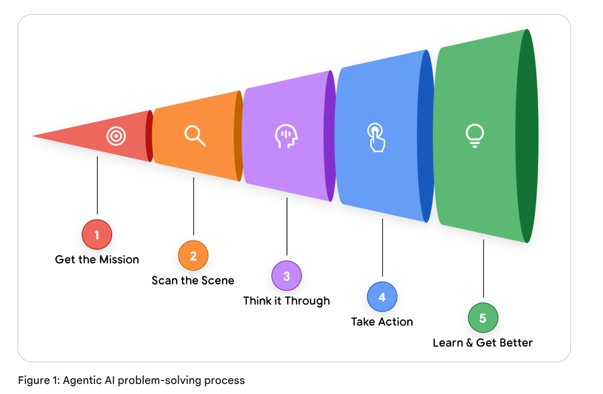
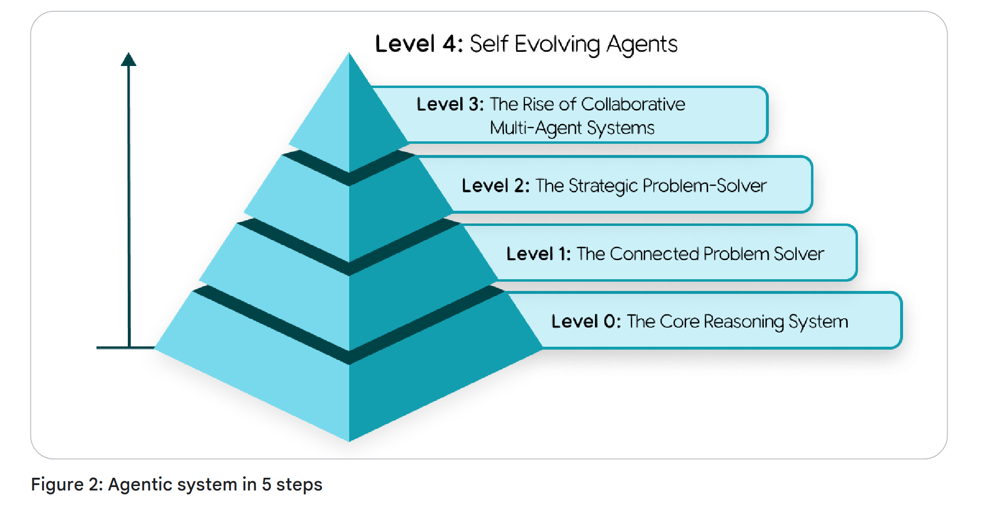

# Introduction to  Agents

## From Predictive AI to Autonomous Agents

Trí tuệ nhân tạo đang thay đổi. Trong nhiều năm, trọng tâm đã đặt vào các mô hình xuất sắc trong những nhiệm vụ rời rạc mang tính thụ động: trả lời câu hỏi, dịch văn bản hoặc tạo hình ảnh từ một gợi ý. Mô hình này, tuy mạnh mẽ, nhưng đòi hỏi sự chỉ đạo liên tục của con người cho mọi bước. Hiện nay, chúng ta đang chứng kiến một sự chuyển đổi mô hình, từ AI chỉ dự đoán hoặc tạo nội dung sang một lớp phần mềm mới có khả năng tự chủ trong việc giải quyết vấn đề và thực thi nhiệm vụ.

Biên giới mới này được xây dựng xoay quanh các Agent AI. Một Agent không chỉ đơn thuần là một mô hình AI trong một quy trình làm việc tĩnh; đó là một ứng dụng hoàn chỉnh, lập kế hoạch và thực hiện hành động để đạt được các mục tiêu. Nó kết hợp khả năng suy luận của Mô hình Ngôn ngữ (LM) với khả năng hành động trong thực tiễn, cho phép nó xử lý các nhiệm vụ phức tạp, nhiều bước mà chỉ một mô hình đơn lẻ thì không thể. Năng lực then chốt là các Agent có thể làm việc một cách tự chủ, tự xác định các bước tiếp theo cần thiết để đạt được mục tiêu mà không cần con người hướng dẫn ở mọi bước. Các Agent là sự phát triển tự nhiên của các Mô hình Ngôn ngữ, được làm cho trở nên hữu ích trong phần mềm.

Tài liệu này là phần đầu tiên trong một loạt gồm năm phần, đóng vai trò như một hướng dẫn chính thức dành cho các nhà phát triển, kiến trúc sư và lãnh đạo sản phẩm trong quá trình chuyển đổi từ các bằng chứng khái niệm sang các hệ thống tác tử (agentic) vững chắc, đạt chuẩn vận hành sản xuất. Mặc dù việc xây dựng một nguyên mẫu đơn giản là tương đối dễ dàng, nhưng việc đảm bảo an ninh, chất lượng và độ tin cậy lại là một thách thức đáng kể. Bài viết này cung cấp một nền tảng toàn diện:

• Giải phẫu lõi: Phân tách một tác tử thành ba thành phần cốt lõi của nó: Mô hình suy luận, Các công cụ có thể hành động và Lớp điều phối (Orchestration Layer) điều hành.  
• Phân loại năng lực: Phân loại các tác tử từ những bộ giải quyết vấn đề đơn giản, có kết nối cho đến các hệ thống đa tác tử phức tạp, mang tính cộng tác.  
• Thiết kế kiến trúc: Đi sâu vào các cân nhắc thiết kế thực tiễn cho từng thành phần, từ lựa chọn mô hình đến triển khai công cụ.  
• Xây dựng cho môi trường sản xuất: Thiết lập kỷ luật Vận hành Tác tử (Agent Ops) cần thiết để đánh giá, gỡ lỗi, bảo mật và mở rộng quy mô các hệ thống tác tử từ một cá thể đơn lẻ lên một cụm lớn với cơ chế quản trị cấp doanh nghiệp.

Dựa trên Sách trắng về Agent và Agent Companion đã công bố trước đó; tài liệu hướng dẫn này cung cấp các khái niệm nền tảng và những khuôn khổ chiến lược mà bạn cần để có thể xây dựng, triển khai và quản lý thành công thế hệ ứng dụng thông minh mới, có khả năng suy luận, hành động và quan sát để hoàn thành các mục tiêu.

> Ngôn từ là không đủ để mô tả cách con người tương tác với AI. Chúng ta có xu hướng nhân hoá và dùng các thuật ngữ của con người như “nghĩ”, “lý luận” và “biết”. Chúng ta vẫn chưa có từ ngữ để phân biệt giữa “biết với ý nghĩa ngữ nghĩa” và “biết với xác suất cao tối đa hóa một hàm phần thưởng”. Đó là hai kiểu “biết” khác nhau, nhưng kết quả lại giống nhau trong 99,X% trường hợp.

## Introduction to AI Agents
Nói một cách đơn giản nhất, một Agent AI có thể được định nghĩa là sự kết hợp giữa **các mô hình**, **công cụ**, **một lớp điều phối** và **các dịch vụ thời gian chạy**, sử dụng Mô hình Ngôn ngữ (LM) trong một vòng lặp để hoàn thành một mục tiêu. Bốn yếu tố này tạo thành kiến trúc cốt lõi của bất kỳ hệ thống tự trị nào.

- **Mô hình (Bộ "Não")**: Mô hình ngôn ngữ lõi (LM) hay mô hình nền tảng đóng vai trò là bộ máy lý luận trung tâm của Agent, dùng để xử lý thông tin, đánh giá các lựa chọn và đưa ra quyết định. Loại mô hình (đa dụng, được tinh chỉnh, hoặc đa phương thức) quyết định năng lực nhận thức của Agent. Một hệ thống mang tính Agent là bên giám tuyển tối hậu đối với cửa sổ ngữ cảnh đầu vào của LM.
- **Công cụ (“Bàn tay”)**: Đây là các cơ chế kết nối quá trình suy luận của Agent với thế giới bên ngoài, cho phép thực hiện các hành động vượt ra ngoài việc sinh văn bản. Chúng bao gồm các tiện ích mở rộng API, các hàm mã và kho dữ liệu (như cơ sở dữ liệu hoặc kho vector) để truy cập thông tin thực tế, theo thời gian thực. Một hệ thống Agent cho phép một mô hình ngôn ngữ lập kế hoạch công cụ nào sẽ sử dụng, thực thi công cụ đó và đưa kết quả của công cụ vào cửa sổ ngữ cảnh đầu vào cho lần gọi mô hình ngôn ngữ tiếp theo.
- **Lớp Điều Phối (Hệ “Thần Kinh”):** Quy trình điều hành quản lý vòng lặp vận hành của Agent. Nó xử lý việc lập kế hoạch, bộ nhớ (trạng thái) và thực thi chiến lược suy luận. Lớp này sử dụng các khuôn khổ nhắc lệnh và kỹ thuật suy luận (như Chain-of-Thought hoặc ReAct) để phân rã các mục tiêu phức tạp thành các bước và quyết định khi nào nên suy nghĩ thay vì sử dụng một công cụ. Lớp này cũng chịu trách nhiệm cung cấp cho các Agent bộ nhớ để “ghi nhớ”.
- **Triển khai (phần “Thân và Chân”)**: Mặc dù xây dựng một Agent trên máy tính xách tay rất hiệu quả cho việc tạo mẫu, nhưng triển khai trong môi trường sản xuất mới là yếu tố khiến nó trở thành một dịch vụ đáng tin cậy và dễ truy cập. Việc này bao gồm việc lưu trữ Agent trên một máy chủ an toàn, có khả năng mở rộng và tích hợp nó với các dịch vụ sản xuất thiết yếu để giám sát, ghi log và quản lý. Sau khi được triển khai, Agent có thể được người dùng truy cập thông qua một giao diện đồ họa hoặc được truy cập một cách lập trình bởi các Agent khác thông qua một API Agent‑tới‑Agent (Agent‑to‑Agent, A2A).

Cuối cùng, việc xây dựng một Agent AI sinh tạo là một cách thức mới để phát triển các giải pháp nhằm giải quyết nhiệm vụ. Nhà phát triển truyền thống đóng vai trò như một “thợ xây gạch”, xác định tỉ mỉ từng bước logic. Ngược lại, nhà phát triển Agent giống như một đạo diễn. Thay vì viết mã rõ ràng cho mọi hành động, bạn thiết lập bối cảnh (các chỉ dẫn và lời nhắc định hướng), lựa chọn dàn diễn viên (các công cụ và API), và cung cấp ngữ cảnh cần thiết (dữ liệu). Nhiệm vụ chính trở thành việc dẫn dắt “diễn viên” tự chủ này để mang lại “màn trình diễn” như mong muốn.

Bạn sẽ nhanh chóng nhận ra rằng điểm mạnh nhất của một mô hình ngôn ngữ (LM) — khả năng linh hoạt đáng kinh ngạc — cũng chính là cơn đau đầu lớn nhất của bạn. Năng lực “làm được mọi thứ” của một mô hình ngôn ngữ lớn khiến việc buộc nó thực hiện một việc cụ thể một cách ổn định và hoàn hảo trở nên khó khăn. Điều mà trước đây chúng ta gọi là “kỹ thuật nhắc lệnh” (prompt engineering) và giờ gọi là “kỹ thuật ngữ cảnh” (context engineering) dùng để dẫn hướng các LM tạo ra đầu ra như mong muốn. Với mỗi lần gọi LM, chúng ta đưa vào các chỉ dẫn, dữ kiện, tập công cụ có thể gọi, ví dụ, lịch sử phiên làm việc, hồ sơ người dùng, v.v. – lấp đầy cửa sổ ngữ cảnh bằng đúng lượng thông tin cần thiết để có được các đầu ra mà chúng ta cần. Agent là phần mềm dùng để quản lý đầu vào của LM nhằm hoàn thành công việc.

Gỡ lỗi trở nên cần thiết khi phát sinh vấn đề. “Agent Ops” về bản chất tái định nghĩa vòng lặp quen thuộc gồm đo lường, phân tích và tối ưu hóa hệ thống. Thông qua các trace và log, bạn có thể theo dõi “quá trình suy nghĩ” của tác tử để xác định những lệch hướng so với lộ trình thực thi dự kiến. Khi các mô hình phát triển và các framework được cải thiện, vai trò của nhà phát triển là cung cấp những thành phần then chốt: domain expertise, một tính cách được định nghĩa rõ ràng, và khả năng tích hợp liền mạch với các công cụ cần thiết cho việc hoàn thành nhiệm vụ trong thực tế. Cần đặc biệt ghi nhớ rằng các đánh giá và thẩm định toàn diện thường có sức ảnh hưởng lớn hơn so với prompt ban đầu.

Khi một Agent được cấu hình một cách chính xác với các chỉ dẫn rõ ràng, các công cụ đáng tin cậy, một ngữ cảnh tích hợp đóng vai trò như bộ nhớ, một giao diện người dùng xuất sắc, khả năng lập kế hoạch và giải quyết vấn đề, cùng với tri thức tổng quát về thế giới, nó vượt lên trên khái niệm “tự động hóa quy trình” thuần túy. Nó bắt đầu hoạt động như một thực thể cộng tác: một thành viên mới trong nhóm của bạn với hiệu suất cao, khả năng thích ứng độc nhất vô nhị và năng lực đáng kinh ngạc.

> Về bản chất, một Agent là một hệ thống chuyên trách cho “nghệ thuật” quản trị cửa sổ ngữ cảnh. Đó là một vòng lặp không ngừng của việc lắp ráp ngữ cảnh, gửi lời nhắc (prompt) cho mô hình, quan sát kết quả, rồi tái lắp ráp ngữ cảnh cho bước tiếp theo. Ngữ cảnh có thể bao gồm hướng dẫn hệ thống, đầu vào của người dùng, lịch sử phiên làm việc, ký ức dài hạn, tri thức nền tảng từ các nguồn có thẩm quyền, những công cụ có thể được sử dụng, và kết quả từ các công cụ đã được gọi trước đó. Việc quản lý tinh vi sự chú ý của mô hình này cho phép năng lực lập luận của nó giải quyết vấn đề trong các tình huống mới và hoàn thành các mục tiêu.

## The Agentic Problem-Solving Process

Chúng tôi đã định nghĩa một Agent AI là một ứng dụng hoàn chỉnh, định hướng mục tiêu, tích hợp mô hình suy luận, các công cụ có thể hành động và một lớp điều phối quản trị. Phiên bản rút gọn là “Các mô hình ngôn ngữ hoạt động trong một vòng lặp với các công cụ để hoàn thành một mục tiêu.”

Nhưng hệ thống này thực sự hoạt động như thế nào? Một Agent làm gì từ lúc nó nhận được một yêu cầu cho đến khi nó đưa ra kết quả?

Cốt lõi của một Agent là vận hành theo một quá trình liên tục và tuần hoàn để đạt được các mục tiêu của nó. Mặc dù vòng lặp này có thể trở nên rất phức tạp, nó có thể được phân tách thành năm bước cơ bản như được trình bày chi tiết trong cuốn sách Agentic System Design.

1. **Get the Mission:** Quy trình được khởi động bởi một mục tiêu cụ thể ở cấp độ cao. Nhiệm vụ này được cung cấp bởi một người dùng (ví dụ: "Sắp xếp việc đi lại cho nhóm của tôi cho hội nghị sắp tới") hoặc bởi một Agent kích hoạt tự động (ví dụ: "Một vé hỗ trợ khách hàng ưu tiên cao mới vừa đến").
2. **Scan the Scene:** Agent quan sát môi trường của mình để thu thập ngữ cảnh. Điều này bao gồm tầng điều phối truy cập các tài nguyên sẵn có của nó: "Yêu cầu của người dùng nói gì?", "Trong bộ nhớ thuật ngữ của tôi có những thông tin nào? Tôi đã từng cố gắng thực hiện tác vụ này chưa? Người dùng có đưa ra hướng dẫn cho tôi vào tuần trước không?", "Tôi có thể truy cập gì từ các công cụ của mình, như lịch, cơ sở dữ liệu, hoặc API?"
3. **Think It Through:** Đây là vòng lặp “suy nghĩ” cốt lõi của Agent, được điều khiển bởi mô hình lập luận. Agent phân tích Nhiệm vụ (Bước 1) so với Bối cảnh (Bước 2) và xây dựng một kế hoạch. Đây không phải là một ý nghĩ đơn lẻ, mà thường là một chuỗi lập luận: “Để đặt chuyến đi, trước hết tôi cần biết ai ở trong nhóm. Tôi sẽ sử dụng công cụ get_team_roster. Sau đó tôi sẽ cần kiểm tra thời gian rảnh của họ thông qua calendar_api.”
4. **Take Action:** Lớp điều phối thực thi bước cụ thể đầu tiên của kế hoạch. Nó lựa chọn và gọi công cụ phù hợp — gọi một API, chạy một hàm mã, hoặc truy vấn một cơ sở dữ liệu. Đây là Agent đang hành động lên thế giới bên ngoài, vượt ra khỏi quá trình suy luận nội bộ của chính nó.
5. **Observe and Iterate:** Agent quan sát kết quả của hành động của mình. Công cụ get_team_roster trả về một danh sách gồm năm tên. Thông tin mới này được thêm vào ngữ cảnh hoặc “bộ nhớ” của Agent. Vòng lặp sau đó được lặp lại, quay trở lại Bước 3: “Bây giờ tôi đã có danh sách thành viên, bước tiếp theo của tôi là kiểm tra lịch của năm người này. Tôi sẽ sử dụng calendar_api.”

Chu trình “Suy nghĩ, Hành động, Quan sát” này tiếp tục diễn ra – được quản lý bởi Tầng Điều phối, được suy luận bởi Mô hình, và được thực thi bởi các Công cụ cho đến khi kế hoạch nội bộ của Agent hoàn tất và Nhiệm vụ ban đầu được hoàn thành.

  

Hãy lấy một ví dụ thực tế về cách một Nhân viên Hỗ trợ Khách hàng hoạt động trong chu trình 5 bước này: 

Hãy tưởng tượng một người dùng hỏi: "Đơn hàng #12345 của tôi đang ở đâu?"

Thay vì hành động ngay lập tức, Agent trước hết bước vào giai đoạn **“Think It Through”** để xây dựng một chiến lược hoàn chỉnh. Nó lý luận rằng:

Người dùng muốn biết tình trạng giao hàng. Để cung cấp một câu trả lời đầy đủ, tôi cần một kế hoạch gồm nhiều bước:  
1. **Identify:** Trước tiên tôi phải tìm đơn hàng trong cơ sở dữ liệu nội bộ của chúng tôi để xác nhận rằng nó tồn tại và lấy thông tin chi tiết của đơn hàng.  
2. **Track:** Từ những thông tin chi tiết đó, tôi sẽ cần trích xuất số theo dõi của đơn vị vận chuyển. Sau đó, tôi sẽ truy vấn API của đơn vị vận chuyển bên ngoài để lấy trạng thái giao hàng theo thời gian thực.  
3. **Report:** Cuối cùng, tôi phải tổng hợp các thông tin đã thu thập được thành một phản hồi rõ ràng, hữu ích cho người dùng.  

Với kế hoạch nhiều bước này trong đầu, Agent bắt đầu thực thi.

Trong giai đoạn "Hành động" đầu tiên, Agent thực hiện bước một trong kế hoạch của mình bằng cách gọi công cụ find_order("12345"). Nó quan sát kết quả—một bản ghi đơn hàng đầy đủ, bao gồm cả số theo dõi "ZYX987." 

Lớp điều phối của Agent nhận ra rằng phần đầu tiên của kế hoạch đã hoàn tất và lập tức chuyển sang phần thứ hai. Nó hành động bằng cách gọi công cụ get_shipping_status("ZYX987"). Nó quan sát kết quả mới: "Out for Delivery." 

Cuối cùng, sau khi đã thực hiện thành công các giai đoạn thu thập dữ liệu trong kế hoạch, Agent chuyển sang bước "Báo cáo". Nó nhận thấy rằng mình đã có đầy đủ các thành phần cần thiết, lập kế hoạch cho thông điệp cuối cùng và hành động bằng cách tạo ra phản hồi: "Đơn hàng #12345 của bạn đang ở trạng thái 'Out for Delivery'!"

## A Taxonomy of Agentic Systems (Một Phân Loại Hệ Thống Tác Tử)

Hiểu vòng lặp vận hành 5 bước là phần đầu tiên của bài toán. Phần thứ hai là nhận ra rằng vòng lặp này có thể được mở rộng về mức độ phức tạp để tạo ra các lớp Agent khác nhau. Đối với một kiến trúc sư hoặc lãnh đạo sản phẩm, một quyết định khởi đầu then chốt là xác định phạm vi loại Agent cần xây dựng. 

Chúng ta có thể phân loại các hệ thống mang tính Agent thành một vài cấp độ rộng, mỗi cấp độ được xây dựng dựa trên các khả năng của cấp độ trước đó.

  

### Level 0: The Core Reasoning System (Hệ thống suy luận cơ bản)

Trước khi có thể xây dựng một tác tử, chúng ta phải bắt đầu với “Bộ não” ở dạng cơ bản nhất của nó: chính động cơ suy luận. Trong cấu hình này, một Mô hình Ngôn ngữ (LM) hoạt động một cách biệt lập, phản hồi hoàn toàn dựa trên lượng tri thức đã được huấn luyện trước khổng lồ của nó mà không có bất kỳ công cụ, bộ nhớ, hay tương tác nào với môi trường trực tiếp.

Điểm mạnh của nó nằm ở quá trình huấn luyện chuyên sâu này, cho phép nó giải thích các khái niệm đã được thiết lập và lập kế hoạch cách tiếp cận giải quyết một vấn đề với độ sâu lớn. Sự đánh đổi là hoàn toàn thiếu nhận thức theo thời gian thực; về mặt chức năng, nó “mù” trước bất kỳ sự kiện hay sự thật nào nằm ngoài dữ liệu huấn luyện của nó.

Ví dụ, nó có thể giải thích các luật của bóng chày chuyên nghiệp và toàn bộ lịch sử của đội New York Yankees. Nhưng nếu bạn hỏi: “Tỷ số chung cuộc của trận Yankees tối qua là bao nhiêu?”, thì nó sẽ không trả lời được. Trận đấu đó là một sự kiện cụ thể trong thế giới thực xảy ra sau khi dữ liệu huấn luyện của nó được thu thập, nên thông tin đó đơn giản là không tồn tại trong tri thức của nó.

### Level 1: The Connected Problem-Solver (Tác tử giải quyết vấn đề liên kết)

Ở cấp độ này, bộ máy lập luận trở thành một Agent vận hành được bằng cách kết nối với và sử dụng các công cụ bên ngoài – thành phần “Đôi tay” trong kiến trúc của chúng tôi. Khả năng giải quyết vấn đề của nó không còn bị giới hạn trong kho tri thức tĩnh, được huấn luyện sẵn nữa.  

Sử dụng vòng lặp 5 bước, Agent giờ đây có thể trả lời câu hỏi trước đó của chúng ta. Với “Nhiệm vụ”: “Tỉ số chung cuộc của trận Yankees tối qua là bao nhiêu?”, bước “Suy nghĩ” của nó nhận diện đây là một nhu cầu dữ liệu theo thời gian thực. Bước “Hành động” sau đó gọi đến một công cụ, chẳng hạn như Google Search API với ngày tháng và từ khóa phù hợp. Nó “Quan sát” kết quả tìm kiếm (ví dụ: “Yankees thắng 5–3”) và tổng hợp thông tin đó thành câu trả lời cuối cùng.

Khả năng cơ bản này trong việc tương tác với thế giới – dù là sử dụng công cụ tìm kiếm cho một bản điểm, một API tài chính để lấy giá cổ phiếu theo thời gian thực, hay một cơ sở dữ liệu thông qua phương pháp Tạo sinh tăng cường bởi truy xuất (RAG) – chính là năng lực cốt lõi của một tác tử Cấp độ 1.

### Level 2: The Strategic Problem-Solver (Người giải quyết vấn đề mang tính chiến lược)

Cấp 2 đánh dấu một bước mở rộng năng lực đáng kể, chuyển từ việc thực hiện các nhiệm vụ đơn giản sang lập kế hoạch chiến lược cho những mục tiêu phức tạp, nhiều giai đoạn. Kỹ năng then chốt xuất hiện ở đây là kỹ thuật ngữ cảnh (context engineering): khả năng của Agent trong việc chủ động lựa chọn, đóng gói và quản lý những thông tin phù hợp nhất cho từng bước trong kế hoạch của mình.  

Độ chính xác của một Agent phụ thuộc vào một ngữ cảnh tập trung và có chất lượng cao. Kỹ thuật ngữ cảnh giúp tuyển chọn việc phân bổ sự chú ý vốn có giới hạn của mô hình để tránh quá tải và đảm bảo hiệu quả hoạt động.  

Ví dụ, hãy xét “Nhiệm vụ”: “Tìm một quán cà phê tốt nằm ở khoảng giữa văn phòng của tôi tại 1600 Amphitheatre Parkway, Mountain View và văn phòng khách hàng của tôi tại 1 Market St, San Francisco.”

Một Agent Cấp 2 sẽ bắt đầu tạo một kế hoạch:  
1. Suy nghĩ: "Trước hết tôi phải tìm điểm giữa."  
   • Hành động: Gọi công cụ Bản đồ với cả hai địa chỉ.  
   • Quan sát: "Điểm giữa là Millbrae, California."  

2. Suy nghĩ: "Bây giờ tôi phải tìm các quán cà phê ở Millbrae. Người dùng yêu cầu các quán 'tốt', vì vậy tôi sẽ tìm các địa điểm có xếp hạng từ 4 sao trở lên."
   
   • Hành động: Gọi công cụ google_places với query="coffee shop in Millbrae, CA", min_rating=4.0. (Đây là kỹ thuật xây dựng ngữ cảnh - nó tự động tạo ra một truy vấn tìm kiếm mới, tập trung hơn từ kết quả của bước trước).  
    • Quan sát: "Tìm kiếm trả về 'Millbrae Coffee' và 'The Daily Grind'."  
3. Suy nghĩ: "Tôi sẽ tổng hợp các kết quả này và trình bày cho người dùng."

Việc lập kế hoạch chiến lược này cũng cho phép hỗ trợ chủ động, giống như một Agent có thể đọc một email xác nhận chuyến bay dài, trích xuất các ngữ cảnh then chốt (số hiệu chuyến bay, ngày tháng), rồi hành động bằng cách thêm chúng vào lịch của bạn.

### Level 3: The Collaborative Multi-Agent System

Ở cấp độ cao nhất, mô hình tư duy thay đổi hoàn toàn. Chúng ta rời bỏ việc xây dựng một “siêu Agent” đơn lẻ, toàn năng và chuyển sang một “nhóm các chuyên gia” làm việc phối hợp với nhau, một mô hình phản chiếu trực tiếp cách tổ chức của con người. Sức mạnh tập thể của hệ thống nằm ở sự phân công lao động này.

Tại đây, các Agent coi những Agent khác như công cụ. Hãy hình dung một Agent “Quản lý Dự án” nhận một “Nhiệm vụ”: “Ra mắt dòng tai nghe ‘Solaris’ mới của chúng ta.”

Agent Quản lý Dự án không tự mình làm toàn bộ công việc. Nó Hành động bằng cách tạo ra các Nhiệm vụ mới cho nhóm Agent chuyên môn của mình, rất giống với cách vận hành trong đời thực.

1. Giao nhiệm vụ cho MarketResearchAgent: "Phân tích giá của đối thủ cạnh tranh cho tai nghe khử tiếng ồn. Trả lại một tài liệu tóm tắt vào ngày mai."

2. Giao nhiệm vụ cho MarketingAgent: "Soạn thảo ba phiên bản thông cáo báo chí, sử dụng bản thông số kỹ thuật sản phẩm 'Solaris' làm ngữ cảnh."  

3. Giao nhiệm vụ cho WebDevAgent: "Tạo mã HTML cho trang sản phẩm mới dựa trên các bản thiết kế mẫu đính kèm."

Mặc dù hiện đang bị giới hạn bởi những hạn chế về năng lực lập luận của các mô hình ngôn ngữ hiện nay, mô hình hợp tác này đại diện cho tuyến đầu trong việc tự động hóa toàn bộ các quy trình công việc kinh doanh phức tạp từ đầu đến cuối.

### Level 4: The Self-Evolving System

Cấp độ 4 thể hiện một bước nhảy vọt sâu sắc từ ủy quyền sang tự chủ trong sáng tạo và thích ứng. Ở cấp độ này, một hệ thống tác tử có thể tự xác định những khoảng trống trong năng lực của chính nó và năng động tạo ra các công cụ mới hoặc thậm chí các tác tử mới để lấp đầy những khoảng trống đó. Nó chuyển từ việc sử dụng một tập hợp tài nguyên cố định sang chủ động mở rộng chúng. 

Tiếp tục với ví dụ của chúng ta, tác tử "Quản lý Dự án", được giao nhiệm vụ triển khai "Solaris", có thể nhận ra rằng nó cần theo dõi cảm xúc trên mạng xã hội, nhưng lại không tồn tại công cụ hay tác tử nào như vậy trong đội của nó.

1. Suy nghĩ (Siêu lập luận): "Tôi phải theo dõi mức độ lan truyền trên mạng xã hội về 'Solaris', nhưng tôi thiếu khả năng đó."  
2. Hành động (Tự động tạo tác): Thay vì thất bại, nó gọi một công cụ AgentCreator cấp cao với sứ mệnh mới: "Xây dựng một tác tử mới để giám sát mạng xã hội với các từ khóa 'Solaris headphones', thực hiện phân tích cảm xúc và báo cáo bản tóm tắt hằng ngày."  
3. Quan sát: Một SentimentAnalysisAgent chuyên biệt mới được tạo, kiểm thử và bổ sung ngay vào nhóm, sẵn sàng đóng góp cho sứ mệnh ban đầu.

Mức độ tự chủ này, trong đó một hệ thống có thể tự động mở rộng năng lực của chính mình, biến một nhóm Agent thành một tổ chức thực sự biết học hỏi và phát triển.

## Core Agent Architecture: Model, Tools, and Orchestration