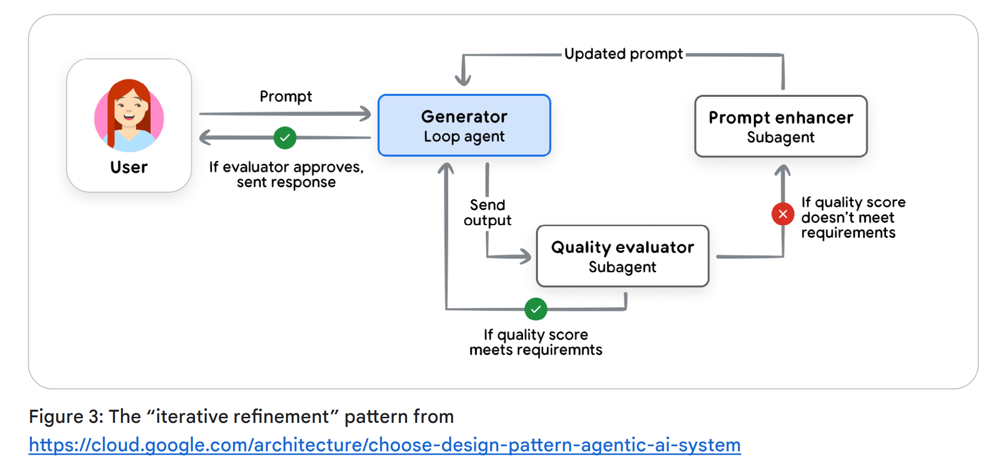
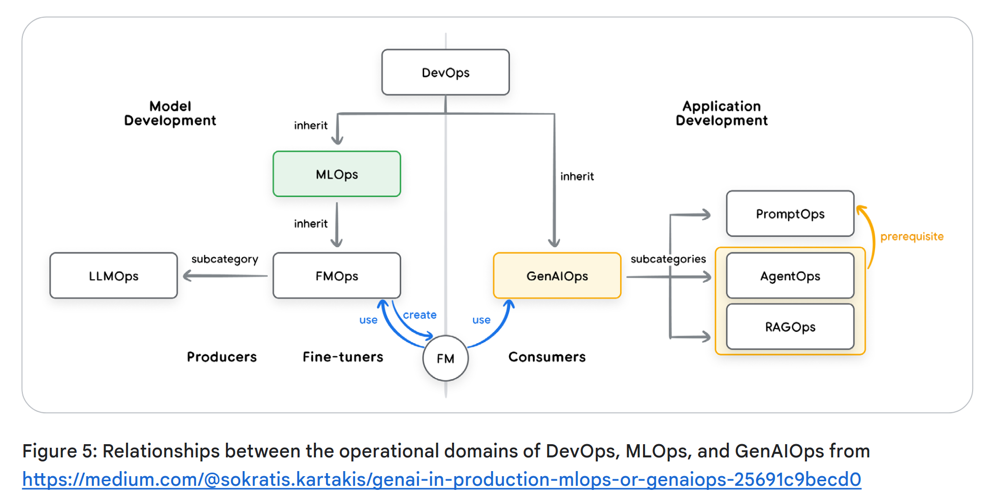
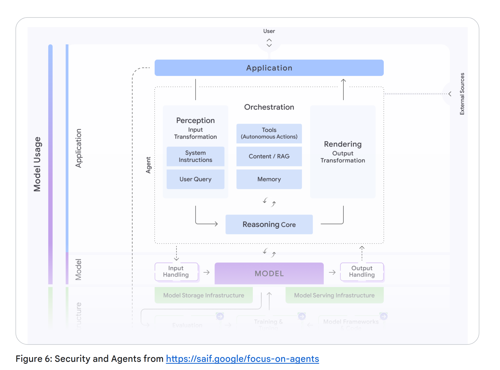
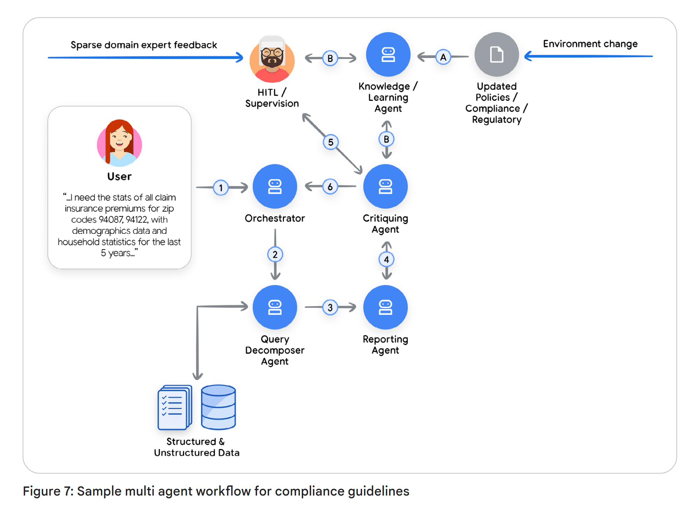
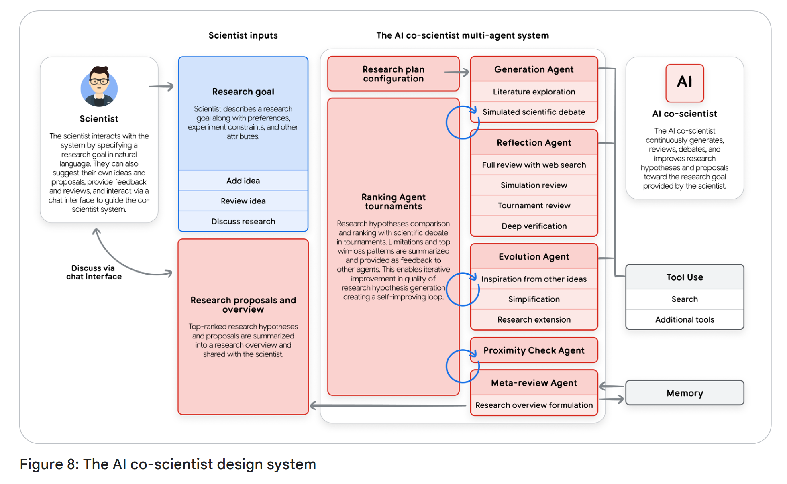
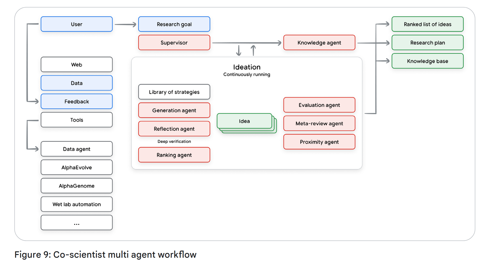
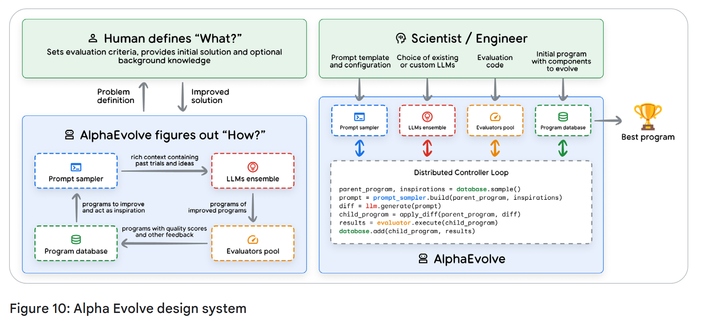
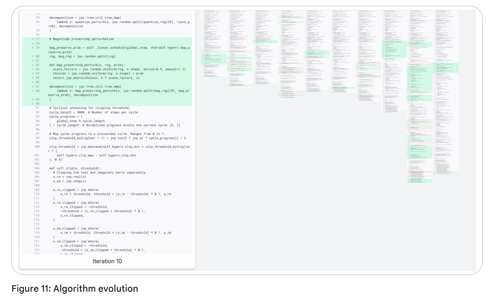

# Introduction to  Agents

## From Predictive AI to Autonomous Agents

Trí tuệ nhân tạo đang thay đổi. Trong nhiều năm, trọng tâm đã đặt vào các mô hình xuất sắc trong những nhiệm vụ rời rạc mang tính thụ động: trả lời câu hỏi, dịch văn bản hoặc tạo hình ảnh từ một gợi ý. Mô hình này, tuy mạnh mẽ, nhưng đòi hỏi sự chỉ đạo liên tục của con người cho mọi bước. Hiện nay, chúng ta đang chứng kiến một sự chuyển đổi mô hình, từ AI chỉ dự đoán hoặc tạo nội dung sang một lớp phần mềm mới có khả năng tự chủ trong việc giải quyết vấn đề và thực thi nhiệm vụ.

Biên giới mới này được xây dựng xoay quanh các Agent AI. Một Agent không chỉ đơn thuần là một mô hình AI trong một quy trình làm việc tĩnh; đó là một ứng dụng hoàn chỉnh, lập kế hoạch và thực hiện hành động để đạt được các mục tiêu. Nó kết hợp khả năng suy luận của Mô hình Ngôn ngữ (LM) với khả năng hành động trong thực tiễn, cho phép nó xử lý các nhiệm vụ phức tạp, nhiều bước mà chỉ một mô hình đơn lẻ thì không thể. Năng lực then chốt là các Agent có thể làm việc một cách tự chủ, tự xác định các bước tiếp theo cần thiết để đạt được mục tiêu mà không cần con người hướng dẫn ở mọi bước. Các Agent là sự phát triển tự nhiên của các Mô hình Ngôn ngữ, được làm cho trở nên hữu ích trong phần mềm.

Tài liệu này là phần đầu tiên trong một loạt gồm năm phần, đóng vai trò như một hướng dẫn chính thức dành cho các nhà phát triển, kiến trúc sư và lãnh đạo sản phẩm trong quá trình chuyển đổi từ các bằng chứng khái niệm sang các hệ thống agentic (agentic) vững chắc, đạt chuẩn vận hành sản xuất. Mặc dù việc xây dựng một nguyên mẫu đơn giản là tương đối dễ dàng, nhưng việc đảm bảo an ninh, chất lượng và độ tin cậy lại là một thách thức đáng kể. Bài viết này cung cấp một nền tảng toàn diện:

• Giải phẫu lõi: Phân tách một agentic thành ba thành phần cốt lõi của nó: Mô hình suy luận, Các công cụ có thể hành động và Lớp điều phối (Orchestration Layer) điều hành.  
• Phân loại năng lực: Phân loại các agentic từ những bộ giải quyết vấn đề đơn giản, có kết nối cho đến các hệ thống đa agentic phức tạp, mang tính cộng tác.  
• Thiết kế kiến trúc: Đi sâu vào các cân nhắc thiết kế thực tiễn cho từng thành phần, từ lựa chọn mô hình đến triển khai công cụ.  
• Xây dựng cho môi trường sản xuất: Thiết lập kỷ luật Vận hành agentic (Agent Ops) cần thiết để đánh giá, gỡ lỗi, bảo mật và mở rộng quy mô các hệ thống agentic từ một cá thể đơn lẻ lên một cụm lớn với cơ chế quản trị cấp doanh nghiệp.

Dựa trên Sách trắng về Agent và Agent Companion đã công bố trước đó; tài liệu hướng dẫn này cung cấp các khái niệm nền tảng và những khuôn khổ chiến lược mà bạn cần để có thể xây dựng, triển khai và quản lý thành công thế hệ ứng dụng thông minh mới, có khả năng suy luận, hành động và quan sát để hoàn thành các mục tiêu.

> Ngôn từ là không đủ để mô tả cách con người tương tác với AI. Chúng ta có xu hướng nhân hoá và dùng các thuật ngữ của con người như “nghĩ”, “lý luận” và “biết”. Chúng ta vẫn chưa có từ ngữ để phân biệt giữa “biết với ý nghĩa ngữ nghĩa” và “biết với xác suất cao tối đa hóa một hàm phần thưởng”. Đó là hai kiểu “biết” khác nhau, nhưng kết quả lại giống nhau trong 99,X% trường hợp.

## Introduction to AI Agents
Nói một cách đơn giản nhất, một Agent AI có thể được định nghĩa là sự kết hợp giữa **các mô hình**, **công cụ**, **một lớp điều phối** và **các dịch vụ thời gian chạy**, sử dụng Mô hình Ngôn ngữ (LM) trong một vòng lặp để hoàn thành một mục tiêu. Bốn yếu tố này tạo thành kiến trúc cốt lõi của bất kỳ hệ thống tự trị nào.

- **Mô hình (Bộ "Não")**: Mô hình ngôn ngữ lõi (LM) hay mô hình nền tảng đóng vai trò là bộ máy lý luận trung tâm của Agent, dùng để xử lý thông tin, đánh giá các lựa chọn và đưa ra quyết định. Loại mô hình (đa dụng, được tinh chỉnh, hoặc đa phương thức) quyết định năng lực nhận thức của Agent. Một hệ thống mang tính Agent là bên giám tuyển tối hậu đối với cửa sổ ngữ cảnh đầu vào của LM.
- **Công cụ (“Bàn tay”)**: Đây là các cơ chế kết nối quá trình suy luận của Agent với thế giới bên ngoài, cho phép thực hiện các hành động vượt ra ngoài việc sinh văn bản. Chúng bao gồm các tiện ích mở rộng API, các hàm mã và kho dữ liệu (như cơ sở dữ liệu hoặc kho vector) để truy cập thông tin thực tế, theo thời gian thực. Một hệ thống Agent cho phép một mô hình ngôn ngữ lập kế hoạch công cụ nào sẽ sử dụng, thực thi công cụ đó và đưa kết quả của công cụ vào cửa sổ ngữ cảnh đầu vào cho lần gọi mô hình ngôn ngữ tiếp theo.
- **Lớp Điều Phối (Hệ “Thần Kinh”):** Quy trình điều hành quản lý vòng lặp vận hành của Agent. Nó xử lý việc lập kế hoạch, bộ nhớ (trạng thái) và thực thi chiến lược suy luận. Lớp này sử dụng các khuôn khổ nhắc lệnh và kỹ thuật suy luận (như Chain-of-Thought hoặc ReAct) để phân rã các mục tiêu phức tạp thành các bước và quyết định khi nào nên suy nghĩ thay vì sử dụng một công cụ. Lớp này cũng chịu trách nhiệm cung cấp cho các Agent bộ nhớ để “ghi nhớ”.
- **Triển khai (phần “Thân và Chân”)**: Mặc dù xây dựng một Agent trên máy tính xách tay rất hiệu quả cho việc tạo mẫu, nhưng triển khai trong môi trường sản xuất mới là yếu tố khiến nó trở thành một dịch vụ đáng tin cậy và dễ truy cập. Việc này bao gồm việc lưu trữ Agent trên một máy chủ an toàn, có khả năng mở rộng và tích hợp nó với các dịch vụ sản xuất thiết yếu để giám sát, ghi log và quản lý. Sau khi được triển khai, Agent có thể được người dùng truy cập thông qua một giao diện đồ họa hoặc được truy cập một cách lập trình bởi các Agent khác thông qua một API Agent‑tới‑Agent (Agent‑to‑Agent, A2A).

Cuối cùng, việc xây dựng một Agent AI sinh tạo là một cách thức mới để phát triển các giải pháp nhằm giải quyết nhiệm vụ. Nhà phát triển truyền thống đóng vai trò như một “thợ xây gạch”, xác định tỉ mỉ từng bước logic. Ngược lại, nhà phát triển Agent giống như một đạo diễn. Thay vì viết mã rõ ràng cho mọi hành động, bạn thiết lập bối cảnh (các chỉ dẫn và lời nhắc định hướng), lựa chọn dàn diễn viên (các công cụ và API), và cung cấp ngữ cảnh cần thiết (dữ liệu). Nhiệm vụ chính trở thành việc dẫn dắt “diễn viên” tự chủ này để mang lại “màn trình diễn” như mong muốn.

Bạn sẽ nhanh chóng nhận ra rằng điểm mạnh nhất của một mô hình ngôn ngữ (LM) — khả năng linh hoạt đáng kinh ngạc — cũng chính là cơn đau đầu lớn nhất của bạn. Năng lực “làm được mọi thứ” của một mô hình ngôn ngữ lớn khiến việc buộc nó thực hiện một việc cụ thể một cách ổn định và hoàn hảo trở nên khó khăn. Điều mà trước đây chúng ta gọi là “kỹ thuật nhắc lệnh” (prompt engineering) và giờ gọi là “kỹ thuật ngữ cảnh” (context engineering) dùng để dẫn hướng các LM tạo ra đầu ra như mong muốn. Với mỗi lần gọi LM, chúng ta đưa vào các chỉ dẫn, dữ kiện, tập công cụ có thể gọi, ví dụ, lịch sử phiên làm việc, hồ sơ người dùng, v.v. – lấp đầy cửa sổ ngữ cảnh bằng đúng lượng thông tin cần thiết để có được các đầu ra mà chúng ta cần. Agent là phần mềm dùng để quản lý đầu vào của LM nhằm hoàn thành công việc.

Gỡ lỗi trở nên cần thiết khi phát sinh vấn đề. “Agent Ops” về bản chất tái định nghĩa vòng lặp quen thuộc gồm đo lường, phân tích và tối ưu hóa hệ thống. Thông qua các trace và log, bạn có thể theo dõi “quá trình suy nghĩ” của agentic để xác định những lệch hướng so với lộ trình thực thi dự kiến. Khi các mô hình phát triển và các framework được cải thiện, vai trò của nhà phát triển là cung cấp những thành phần then chốt: domain expertise, một tính cách được định nghĩa rõ ràng, và khả năng tích hợp liền mạch với các công cụ cần thiết cho việc hoàn thành nhiệm vụ trong thực tế. Cần đặc biệt ghi nhớ rằng các đánh giá và thẩm định toàn diện thường có sức ảnh hưởng lớn hơn so với prompt ban đầu.

Khi một Agent được cấu hình một cách chính xác với các chỉ dẫn rõ ràng, các công cụ đáng tin cậy, một ngữ cảnh tích hợp đóng vai trò như bộ nhớ, một giao diện người dùng xuất sắc, khả năng lập kế hoạch và giải quyết vấn đề, cùng với tri thức tổng quát về thế giới, nó vượt lên trên khái niệm “tự động hóa quy trình” thuần túy. Nó bắt đầu hoạt động như một thực thể cộng tác: một thành viên mới trong nhóm của bạn với hiệu suất cao, khả năng thích ứng độc nhất vô nhị và năng lực đáng kinh ngạc.

> Về bản chất, một Agent là một hệ thống chuyên trách cho “nghệ thuật” quản trị cửa sổ ngữ cảnh. Đó là một vòng lặp không ngừng của việc lắp ráp ngữ cảnh, gửi lời nhắc (prompt) cho mô hình, quan sát kết quả, rồi tái lắp ráp ngữ cảnh cho bước tiếp theo. Ngữ cảnh có thể bao gồm hướng dẫn hệ thống, đầu vào của người dùng, lịch sử phiên làm việc, ký ức dài hạn, tri thức nền tảng từ các nguồn có thẩm quyền, những công cụ có thể được sử dụng, và kết quả từ các công cụ đã được gọi trước đó. Việc quản lý tinh vi sự chú ý của mô hình này cho phép năng lực lập luận của nó giải quyết vấn đề trong các tình huống mới và hoàn thành các mục tiêu.

## The Agentic Problem-Solving Process

Chúng tôi đã định nghĩa một Agent AI là một ứng dụng hoàn chỉnh, định hướng mục tiêu, tích hợp mô hình suy luận, các công cụ có thể hành động và một lớp điều phối quản trị. Phiên bản rút gọn là “Các mô hình ngôn ngữ hoạt động trong một vòng lặp với các công cụ để hoàn thành một mục tiêu.”

Nhưng hệ thống này thực sự hoạt động như thế nào? Một Agent làm gì từ lúc nó nhận được một yêu cầu cho đến khi nó đưa ra kết quả?

Cốt lõi của một Agent là vận hành theo một quá trình liên tục và tuần hoàn để đạt được các mục tiêu của nó. Mặc dù vòng lặp này có thể trở nên rất phức tạp, nó có thể được phân tách thành năm bước cơ bản như được trình bày chi tiết trong cuốn sách Agentic System Design.

1. **Get the Mission:** Quy trình được khởi động bởi một mục tiêu cụ thể ở cấp độ cao. Nhiệm vụ này được cung cấp bởi một người dùng (ví dụ: "Sắp xếp việc đi lại cho nhóm của tôi cho hội nghị sắp tới") hoặc bởi một Agent kích hoạt tự động (ví dụ: "Một vé hỗ trợ khách hàng ưu tiên cao mới vừa đến").
2. **Scan the Scene:** Agent quan sát môi trường của mình để thu thập ngữ cảnh. Điều này bao gồm tầng điều phối truy cập các tài nguyên sẵn có của nó: "Yêu cầu của người dùng nói gì?", "Trong bộ nhớ thuật ngữ của tôi có những thông tin nào? Tôi đã từng cố gắng thực hiện tác vụ này chưa? Người dùng có đưa ra hướng dẫn cho tôi vào tuần trước không?", "Tôi có thể truy cập gì từ các công cụ của mình, như lịch, cơ sở dữ liệu, hoặc API?"
3. **Think It Through:** Đây là vòng lặp “suy nghĩ” cốt lõi của Agent, được điều khiển bởi mô hình lập luận. Agent phân tích Nhiệm vụ (Bước 1) so với Bối cảnh (Bước 2) và xây dựng một kế hoạch. Đây không phải là một ý nghĩ đơn lẻ, mà thường là một chuỗi lập luận: “Để đặt chuyến đi, trước hết tôi cần biết ai ở trong nhóm. Tôi sẽ sử dụng công cụ get_team_roster. Sau đó tôi sẽ cần kiểm tra thời gian rảnh của họ thông qua calendar_api.”
4. **Take Action:** Lớp điều phối thực thi bước cụ thể đầu tiên của kế hoạch. Nó lựa chọn và gọi công cụ phù hợp — gọi một API, chạy một hàm mã, hoặc truy vấn một cơ sở dữ liệu. Đây là Agent đang hành động lên thế giới bên ngoài, vượt ra khỏi quá trình suy luận nội bộ của chính nó.
5. **Observe and Iterate:** Agent quan sát kết quả của hành động của mình. Công cụ get_team_roster trả về một danh sách gồm năm tên. Thông tin mới này được thêm vào ngữ cảnh hoặc “bộ nhớ” của Agent. Vòng lặp sau đó được lặp lại, quay trở lại Bước 3: “Bây giờ tôi đã có danh sách thành viên, bước tiếp theo của tôi là kiểm tra lịch của năm người này. Tôi sẽ sử dụng calendar_api.”

Chu trình “Suy nghĩ, Hành động, Quan sát” này tiếp tục diễn ra – được quản lý bởi Tầng Điều phối, được suy luận bởi Mô hình, và được thực thi bởi các Công cụ cho đến khi kế hoạch nội bộ của Agent hoàn tất và Nhiệm vụ ban đầu được hoàn thành.

  

Hãy lấy một ví dụ thực tế về cách một Nhân viên Hỗ trợ Khách hàng hoạt động trong chu trình 5 bước này: 

Hãy tưởng tượng một người dùng hỏi: "Đơn hàng #12345 của tôi đang ở đâu?"

Thay vì hành động ngay lập tức, Agent trước hết bước vào giai đoạn **“Think It Through”** để xây dựng một chiến lược hoàn chỉnh. Nó lý luận rằng:

Người dùng muốn biết tình trạng giao hàng. Để cung cấp một câu trả lời đầy đủ, tôi cần một kế hoạch gồm nhiều bước:  
1. **Identify:** Trước tiên tôi phải tìm đơn hàng trong cơ sở dữ liệu nội bộ của chúng tôi để xác nhận rằng nó tồn tại và lấy thông tin chi tiết của đơn hàng.  
2. **Track:** Từ những thông tin chi tiết đó, tôi sẽ cần trích xuất số theo dõi của đơn vị vận chuyển. Sau đó, tôi sẽ truy vấn API của đơn vị vận chuyển bên ngoài để lấy trạng thái giao hàng theo thời gian thực.  
3. **Report:** Cuối cùng, tôi phải tổng hợp các thông tin đã thu thập được thành một phản hồi rõ ràng, hữu ích cho người dùng.  

Với kế hoạch nhiều bước này trong đầu, Agent bắt đầu thực thi.

Trong giai đoạn "Hành động" đầu tiên, Agent thực hiện bước một trong kế hoạch của mình bằng cách gọi công cụ find_order("12345"). Nó quan sát kết quả—một bản ghi đơn hàng đầy đủ, bao gồm cả số theo dõi "ZYX987." 

Lớp điều phối của Agent nhận ra rằng phần đầu tiên của kế hoạch đã hoàn tất và lập tức chuyển sang phần thứ hai. Nó hành động bằng cách gọi công cụ get_shipping_status("ZYX987"). Nó quan sát kết quả mới: "Out for Delivery." 

Cuối cùng, sau khi đã thực hiện thành công các giai đoạn thu thập dữ liệu trong kế hoạch, Agent chuyển sang bước "Báo cáo". Nó nhận thấy rằng mình đã có đầy đủ các thành phần cần thiết, lập kế hoạch cho thông điệp cuối cùng và hành động bằng cách tạo ra phản hồi: "Đơn hàng #12345 của bạn đang ở trạng thái 'Out for Delivery'!"

## A Taxonomy of Agentic Systems (Một Phân Loại Hệ Thống agentic)

Hiểu vòng lặp vận hành 5 bước là phần đầu tiên của bài toán. Phần thứ hai là nhận ra rằng vòng lặp này có thể được mở rộng về mức độ phức tạp để tạo ra các lớp Agent khác nhau. Đối với một kiến trúc sư hoặc lãnh đạo sản phẩm, một quyết định khởi đầu then chốt là xác định phạm vi loại Agent cần xây dựng. 

Chúng ta có thể phân loại các hệ thống mang tính Agent thành một vài cấp độ rộng, mỗi cấp độ được xây dựng dựa trên các khả năng của cấp độ trước đó.

  

### Level 0: The Core Reasoning System (Hệ thống suy luận cơ bản)

Trước khi có thể xây dựng một agentic, chúng ta phải bắt đầu với “Bộ não” ở dạng cơ bản nhất của nó: chính động cơ suy luận. Trong cấu hình này, một Mô hình Ngôn ngữ (LM) hoạt động một cách biệt lập, phản hồi hoàn toàn dựa trên lượng tri thức đã được huấn luyện trước khổng lồ của nó mà không có bất kỳ công cụ, bộ nhớ, hay tương tác nào với môi trường trực tiếp.

Điểm mạnh của nó nằm ở quá trình huấn luyện chuyên sâu này, cho phép nó giải thích các khái niệm đã được thiết lập và lập kế hoạch cách tiếp cận giải quyết một vấn đề với độ sâu lớn. Sự đánh đổi là hoàn toàn thiếu nhận thức theo thời gian thực; về mặt chức năng, nó “mù” trước bất kỳ sự kiện hay sự thật nào nằm ngoài dữ liệu huấn luyện của nó.

Ví dụ, nó có thể giải thích các luật của bóng chày chuyên nghiệp và toàn bộ lịch sử của đội New York Yankees. Nhưng nếu bạn hỏi: “Tỷ số chung cuộc của trận Yankees tối qua là bao nhiêu?”, thì nó sẽ không trả lời được. Trận đấu đó là một sự kiện cụ thể trong thế giới thực xảy ra sau khi dữ liệu huấn luyện của nó được thu thập, nên thông tin đó đơn giản là không tồn tại trong tri thức của nó.

### Level 1: The Connected Problem-Solver (agentic giải quyết vấn đề liên kết)

Ở cấp độ này, bộ máy lập luận trở thành một Agent vận hành được bằng cách kết nối với và sử dụng các công cụ bên ngoài – thành phần “Đôi tay” trong kiến trúc của chúng tôi. Khả năng giải quyết vấn đề của nó không còn bị giới hạn trong kho tri thức tĩnh, được huấn luyện sẵn nữa.  

Sử dụng vòng lặp 5 bước, Agent giờ đây có thể trả lời câu hỏi trước đó của chúng ta. Với “Nhiệm vụ”: “Tỉ số chung cuộc của trận Yankees tối qua là bao nhiêu?”, bước “Suy nghĩ” của nó nhận diện đây là một nhu cầu dữ liệu theo thời gian thực. Bước “Hành động” sau đó gọi đến một công cụ, chẳng hạn như Google Search API với ngày tháng và từ khóa phù hợp. Nó “Quan sát” kết quả tìm kiếm (ví dụ: “Yankees thắng 5–3”) và tổng hợp thông tin đó thành câu trả lời cuối cùng.

Khả năng cơ bản này trong việc tương tác với thế giới – dù là sử dụng công cụ tìm kiếm cho một bản điểm, một API tài chính để lấy giá cổ phiếu theo thời gian thực, hay một cơ sở dữ liệu thông qua phương pháp Tạo sinh tăng cường bởi truy xuất (RAG) – chính là năng lực cốt lõi của một agentic Cấp độ 1.

### Level 2: The Strategic Problem-Solver (Người giải quyết vấn đề mang tính chiến lược)

Cấp 2 đánh dấu một bước mở rộng năng lực đáng kể, chuyển từ việc thực hiện các nhiệm vụ đơn giản sang lập kế hoạch chiến lược cho những mục tiêu phức tạp, nhiều giai đoạn. Kỹ năng then chốt xuất hiện ở đây là kỹ thuật ngữ cảnh (context engineering): khả năng của Agent trong việc chủ động lựa chọn, đóng gói và quản lý những thông tin phù hợp nhất cho từng bước trong kế hoạch của mình.  

Độ chính xác của một Agent phụ thuộc vào một ngữ cảnh tập trung và có chất lượng cao. Kỹ thuật ngữ cảnh giúp tuyển chọn việc phân bổ sự chú ý vốn có giới hạn của mô hình để tránh quá tải và đảm bảo hiệu quả hoạt động.  

Ví dụ, hãy xét “Nhiệm vụ”: “Tìm một quán cà phê tốt nằm ở khoảng giữa văn phòng của tôi tại 1600 Amphitheatre Parkway, Mountain View và văn phòng khách hàng của tôi tại 1 Market St, San Francisco.”

Một Agent Cấp 2 sẽ bắt đầu tạo một kế hoạch:  
1. Suy nghĩ: "Trước hết tôi phải tìm điểm giữa."  
   • Hành động: Gọi công cụ Bản đồ với cả hai địa chỉ.  
   • Quan sát: "Điểm giữa là Millbrae, California."  

2. Suy nghĩ: "Bây giờ tôi phải tìm các quán cà phê ở Millbrae. Người dùng yêu cầu các quán 'tốt', vì vậy tôi sẽ tìm các địa điểm có xếp hạng từ 4 sao trở lên."
   
   • Hành động: Gọi công cụ google_places với query="coffee shop in Millbrae, CA", min_rating=4.0. (Đây là kỹ thuật xây dựng ngữ cảnh - nó tự động tạo ra một truy vấn tìm kiếm mới, tập trung hơn từ kết quả của bước trước).  
    • Quan sát: "Tìm kiếm trả về 'Millbrae Coffee' và 'The Daily Grind'."  
3. Suy nghĩ: "Tôi sẽ tổng hợp các kết quả này và trình bày cho người dùng."

Việc lập kế hoạch chiến lược này cũng cho phép hỗ trợ chủ động, giống như một Agent có thể đọc một email xác nhận chuyến bay dài, trích xuất các ngữ cảnh then chốt (số hiệu chuyến bay, ngày tháng), rồi hành động bằng cách thêm chúng vào lịch của bạn.

### Level 3: The Collaborative Multi-Agent System

Ở cấp độ cao nhất, mô hình tư duy thay đổi hoàn toàn. Chúng ta rời bỏ việc xây dựng một “siêu Agent” đơn lẻ, toàn năng và chuyển sang một “nhóm các chuyên gia” làm việc phối hợp với nhau, một mô hình phản chiếu trực tiếp cách tổ chức của con người. Sức mạnh tập thể của hệ thống nằm ở sự phân công lao động này.

Tại đây, các Agent coi những Agent khác như công cụ. Hãy hình dung một Agent “Quản lý Dự án” nhận một “Nhiệm vụ”: “Ra mắt dòng tai nghe ‘Solaris’ mới của chúng ta.”

Agent Quản lý Dự án không tự mình làm toàn bộ công việc. Nó Hành động bằng cách tạo ra các Nhiệm vụ mới cho nhóm Agent chuyên môn của mình, rất giống với cách vận hành trong đời thực.

1. Giao nhiệm vụ cho MarketResearchAgent: "Phân tích giá của đối thủ cạnh tranh cho tai nghe khử tiếng ồn. Trả lại một tài liệu tóm tắt vào ngày mai."

2. Giao nhiệm vụ cho MarketingAgent: "Soạn thảo ba phiên bản thông cáo báo chí, sử dụng bản thông số kỹ thuật sản phẩm 'Solaris' làm ngữ cảnh."  

3. Giao nhiệm vụ cho WebDevAgent: "Tạo mã HTML cho trang sản phẩm mới dựa trên các bản thiết kế mẫu đính kèm."

Mặc dù hiện đang bị giới hạn bởi những hạn chế về năng lực lập luận của các mô hình ngôn ngữ hiện nay, mô hình hợp tác này đại diện cho tuyến đầu trong việc tự động hóa toàn bộ các quy trình công việc kinh doanh phức tạp từ đầu đến cuối.

### Level 4: The Self-Evolving System

Cấp độ 4 thể hiện một bước nhảy vọt sâu sắc từ ủy quyền sang tự chủ trong sáng tạo và thích ứng. Ở cấp độ này, một hệ thống agentic có thể tự xác định những khoảng trống trong năng lực của chính nó và năng động tạo ra các công cụ mới hoặc thậm chí các agentic mới để lấp đầy những khoảng trống đó. Nó chuyển từ việc sử dụng một tập hợp tài nguyên cố định sang chủ động mở rộng chúng. 

Tiếp tục với ví dụ của chúng ta, agentic "Quản lý Dự án", được giao nhiệm vụ triển khai "Solaris", có thể nhận ra rằng nó cần theo dõi cảm xúc trên mạng xã hội, nhưng lại không tồn tại công cụ hay agentic nào như vậy trong đội của nó.

1. Suy nghĩ (Siêu lập luận): "Tôi phải theo dõi mức độ lan truyền trên mạng xã hội về 'Solaris', nhưng tôi thiếu khả năng đó."  
2. Hành động (Tự động tạo tác): Thay vì thất bại, nó gọi một công cụ AgentCreator cấp cao với sứ mệnh mới: "Xây dựng một agentic mới để giám sát mạng xã hội với các từ khóa 'Solaris headphones', thực hiện phân tích cảm xúc và báo cáo bản tóm tắt hằng ngày."  
3. Quan sát: Một SentimentAnalysisAgent chuyên biệt mới được tạo, kiểm thử và bổ sung ngay vào nhóm, sẵn sàng đóng góp cho sứ mệnh ban đầu.

Mức độ tự chủ này, trong đó một hệ thống có thể tự động mở rộng năng lực của chính mình, biến một nhóm Agent thành một tổ chức thực sự biết học hỏi và phát triển.

## Core Agent Architecture: Model, Tools, and Orchestration

Chúng ta biết một Agent làm gì và nó có thể mở rộng như thế nào. Nhưng trên thực tế, chúng ta xây dựng nó ra sao? Sự chuyển đổi từ khái niệm sang mã nguồn nằm ở thiết kế kiến trúc cụ thể của ba thành phần cốt lõi của nó.

### Model: The “Brain” of your AI Agent

LM là lõi suy luận của Agent của bạn, và việc lựa chọn nó là một quyết định kiến trúc mang tính then chốt, quyết định năng lực nhận thức, chi phí vận hành và tốc độ của Agent. Tuy nhiên, coi lựa chọn này như một vấn đề đơn giản là chọn mô hình có điểm chuẩn cao nhất là một con đường thất bại phổ biến. Thành công của một Agent trong môi trường sản xuất hiếm khi được quyết định bởi các thước đo chuẩn học thuật chung.

Thành công trong thế giới thực đòi hỏi một mô hình xuất sắc ở các nền tảng Agent: năng lực suy luận vượt trội để điều hướng các vấn đề phức tạp, nhiều bước và khả năng sử dụng công cụ đáng tin cậy để tương tác với thế giới.

Để thực hiện điều này một cách hiệu quả, hãy bắt đầu bằng việc xác định vấn đề kinh doanh, sau đó kiểm thử các mô hình theo những thước đo gắn trực tiếp với kết quả đó. Nếu Agent của bạn cần viết mã, hãy kiểm thử nó trên cơ sở mã nguồn riêng của bạn. Nếu nó xử lý các yêu cầu bồi thường bảo hiểm, hãy đánh giá khả năng trích xuất thông tin của nó từ các định dạng tài liệu cụ thể của bạn. Sau đó, phân tích này phải được đối chiếu với các yếu tố thực tiễn về chi phí và độ trễ. Mô hình “tốt nhất” là mô hình nằm tại điểm giao tối ưu giữa chất lượng, tốc độ và giá cho nhiệm vụ cụ thể của bạn.

Bạn có thể chọn nhiều hơn một mô hình, một “đội ngũ chuyên gia”. Bạn không dùng búa tạ để đập vỡ một hạt óc chó. Một kiến trúc agentic vững chắc có thể sử dụng một mô hình tiên phong như Gemini 2.5 Pro để đảm nhiệm phần việc nặng của lập kế hoạch ban đầu và suy luận phức tạp, nhưng sau đó định tuyến một cách thông minh các tác vụ đơn giản hơn, khối lượng lớn—như phân loại ý định người dùng hoặc tóm tắt văn bản—sang một mô hình nhanh hơn nhiều và hiệu quả hơn về chi phí như Gemini 2.5 Flash. Việc định tuyến mô hình có thể là tự động hoặc được mã hóa cứng, nhưng là một chiến lược then chốt để tối ưu hóa cả hiệu năng lẫn chi phí.

Nguyên lý tương tự cũng áp dụng cho việc xử lý các kiểu dữ liệu đa dạng. Mặc dù một mô hình đa phương thức bẩm sinh như Gemini live mode cung cấp một lộ trình tinh gọn để xử lý hình ảnh và âm thanh, một phương án thay thế là sử dụng các công cụ chuyên biệt như Cloud Vision API hoặc Speech-to-Text API. Theo mô thức này, thế giới trước hết được chuyển đổi thành văn bản, sau đó được chuyển cho một mô hình chỉ-ngôn-ngữ để suy luận. Cách làm này tăng tính linh hoạt và cho phép sử dụng các thành phần tốt nhất trong từng hạng mục, nhưng cũng đưa vào mức độ phức tạp đáng kể.

Cuối cùng, bối cảnh AI đang ở trong trạng thái tiến hóa nhanh chóng và liên tục. Mô hình bạn chọn hôm nay sẽ bị thay thế trong vòng sáu tháng. Tư duy “thiết lập rồi quên đi” là không bền vững. Xây dựng để phù hợp với thực tế này đồng nghĩa với việc đầu tư vào một khung vận hành linh hoạt—một thực hành “Agent Ops”. Với một đường ống CI/CD vững chắc liên tục đánh giá các mô hình mới theo các chỉ số kinh doanh trọng yếu của bạn, bạn có thể giảm thiểu rủi ro và tăng tốc các nâng cấp, bảo đảm Agent của bạn luôn được vận hành bởi bộ não tốt nhất hiện có mà không đòi hỏi phải đại tu toàn bộ kiến trúc.

### Tools: The "Hands" of your AI Agent

Nếu mô hình là bộ não của Agent, thì các công cụ là đôi tay kết nối suy luận của nó với thực tại. Chúng cho phép Agent vượt ra ngoài dữ liệu huấn luyện tĩnh của mình để truy xuất thông tin theo thời gian thực và thực hiện hành động trong thế giới. Một giao diện công cụ vững chắc là một vòng lặp gồm ba phần: xác định một công cụ có thể làm gì, gọi công cụ, và quan sát kết quả.

Dưới đây là một vài loại công cụ chính mà những người xây dựng Agent sẽ đặt vào “tay” của các Agent của họ. Để tìm hiểu chuyên sâu đầy đủ hơn, hãy xem whitepaper tập trung vào công cụ Agent trong loạt bài này.

#### Retrieving Information: Grounding in Reality

Công cụ nền tảng nhất là khả năng truy cập thông tin cập nhật. Retrieval-Augmented Generation (RAG) cung cấp cho Agent một “thẻ thư viện” để truy vấn tri thức bên ngoài, thường được lưu trữ trong Cơ sở dữ liệu vector hoặc Đồ thị tri thức, trải từ các tài liệu nội bộ của công ty đến tri thức trên web thông qua Google Search. Đối với dữ liệu có cấu trúc, các công cụ Natural Language to SQL (NL2SQL) cho phép Agent truy vấn cơ sở dữ liệu để trả lời các câu hỏi phân tích như: “Những sản phẩm bán chạy nhất của chúng ta trong quý trước là gì?” Bằng cách tra cứu trước khi phát ngôn—dù là trong một tài liệu hay một cơ sở dữ liệu—Agent tự neo mình vào sự thật, qua đó giảm mạnh hiện tượng ảo giác.

#### Executing Actions: Changing the World

Sức mạnh thực sự của các agentic được giải phóng khi chúng chuyển từ việc đọc thông tin sang chủ động thực hiện công việc. Bằng cách đóng gói các API hiện có và các hàm mã như những công cụ, một agentic có thể gửi email, lên lịch một cuộc họp, hoặc cập nhật hồ sơ khách hàng trong ServiceNow. Đối với các tác vụ năng động hơn, một agentic có thể viết và thực thi mã ngay lập tức. Trong một môi trường sandbox an toàn, nó có thể tạo một truy vấn SQL hoặc một tập lệnh Python để giải quyết một vấn đề phức tạp hoặc thực hiện một phép tính, biến đổi nó từ một trợ lý giàu tri thức thành một Agent tự trị.

Điều này cũng bao gồm các công cụ cho tương tác với con người. Một Agent có thể sử dụng công cụ Human in the Loop (HITL) để tạm dừng quy trình làm việc của mình và yêu cầu xác nhận (ví dụ: ask_for_confirmation()) hoặc yêu cầu thông tin cụ thể từ một giao diện người dùng (ví dụ: ask_for_date_input()), bảo đảm rằng có một người tham gia vào các quyết định mang tính then chốt. HITL có thể được triển khai thông qua nhắn tin SMS và một tác vụ trong cơ sở dữ liệu.

#### Function Calling: Connecting Tools to your Agent

Để một Agent có thể thực hiện “gọi hàm” và sử dụng công cụ một cách đáng tin cậy, nó cần các chỉ dẫn rõ ràng, các kết nối an toàn và điều phối. Các tiêu chuẩn lâu đời như đặc tả OpenAPI cung cấp điều này, trao cho Agent một hợp đồng có cấu trúc mô tả mục đích của một công cụ, các tham số bắt buộc và phản hồi dự kiến. Lược đồ này cho phép mô hình tạo ra lời gọi hàm đúng mỗi lần và diễn giải phản hồi API. Để việc khám phá và kết nối với công cụ đơn giản hơn, các tiêu chuẩn mở như Model Context Protocol (MCP) đã trở nên phổ biến vì chúng thuận tiện hơn. Ngoài ra, một vài mô hình có các công cụ gốc, như Gemini với Google Search gốc, trong đó việc gọi hàm diễn ra như một phần của chính lời gọi LM.

### The Orchestration Layer

Nếu mô hình là bộ não của agentic và các công cụ là đôi tay của nó, thì lớp điều phối là hệ thần kinh trung ương kết nối chúng. Đó là động cơ vận hành vòng lặp “Suy nghĩ, Hành động, Quan sát”, là máy trạng thái chi phối hành vi của agentic, và là nơi logic được nhà phát triển dày công xây dựng trở nên sống động. Lớp này không chỉ là phần “đường ống”; nó là người chỉ huy của toàn bộ bản giao hưởng agentic, quyết định khi nào mô hình nên suy luận, công cụ nào nên hành động, và cách các kết quả của hành động đó sẽ định hướng cho nhịp chuyển tiếp theo.

#### Core Design Choices

Quyết định kiến trúc đầu tiên là xác định mức độ tự chủ của Agent. Lựa chọn này tồn tại trên một phổ liên tục. Ở một đầu phổ, bạn có các quy trình làm việc mang tính tất định, có thể dự đoán, gọi một mô hình ngôn ngữ (LM) như một công cụ cho một nhiệm vụ cụ thể—một chút AI để tăng cường một quy trình hiện có. Ở đầu kia, bạn có LM ở vị trí điều khiển, linh hoạt thích ứng, lập kế hoạch và thực thi các nhiệm vụ để đạt được một mục tiêu.

Một lựa chọn song song là phương pháp triển khai. Các công cụ xây dựng không cần mã (no-code) mang lại tốc độ và khả năng tiếp cận, trao quyền cho người dùng doanh nghiệp tự động hóa các tác vụ có cấu trúc và nhanh chóng xây dựng các Agent đơn giản. Đối với các hệ thống phức tạp hơn, có tính sống còn đối với sứ mệnh (mission-critical), các khung (framework) ưu tiên mã (code-first), chẳng hạn như Agent Development Kit (ADK) của Google, cung cấp mức độ kiểm soát sâu, khả năng tùy biến và năng lực tích hợp mà các kỹ sư yêu cầu.

Bất kể cách tiếp cận nào, một khung làm việc đạt chuẩn triển khai sản xuất là thiết yếu. Khung này phải mang tính mở, cho phép bạn tích hợp bất kỳ mô hình hoặc công cụ nào để tránh bị khóa bởi nhà cung cấp. Khung này phải cung cấp khả năng kiểm soát chính xác, cho phép một cách tiếp cận lai trong đó suy luận phi tất định của một mô hình ngôn ngữ (LM) được chi phối bởi các quy tắc nghiệp vụ được mã hóa cứng. Quan trọng nhất, khung làm việc phải được xây dựng nhằm phục vụ khả năng quan sát. Khi một Agent hành xử ngoài dự kiến, bạn không thể đơn giản đặt một điểm dừng trong “suy nghĩ” của mô hình. Một khung làm việc vững chắc tạo ra các dấu vết và nhật ký chi tiết, phơi bày toàn bộ quỹ đạo suy luận: độc thoại nội tâm của mô hình, công cụ mà nó đã chọn, các tham số mà nó đã tạo ra, và kết quả mà nó đã quan sát.

#### Instruct with Domain Knowledge and Persona

Trong khuôn khổ này, đòn bẩy mạnh mẽ nhất của nhà phát triển là hướng dẫn Agent bằng tri thức miền và một nhân dạng riêng biệt. Điều này được thực hiện thông qua một lời nhắc hệ thống hoặc một tập hợp các chỉ dẫn cốt lõi. Đây không chỉ là một mệnh lệnh đơn giản; đó là hiến pháp của Agent.

Tại đây, bạn nói với nó rằng: “Bạn là một nhân viên hỗ trợ khách hàng hữu ích cho Acme Corp, ...” và cung cấp các ràng buộc, lược đồ đầu ra mong muốn, các quy tắc tương tác, một giọng điệu cụ thể, cùng hướng dẫn tường minh về khi nào và vì sao nó nên sử dụng các công cụ của mình. Một vài kịch bản ví dụ trong phần hướng dẫn thường rất hiệu quả.

#### Augment with Context

“Bộ nhớ” của Agent được điều phối vào cửa sổ ngữ cảnh của LM trong thời gian chạy. Để tìm hiểu sâu hơn và đầy đủ hơn, hãy xem whitepaper trong loạt bài này tập trung vào bộ nhớ của Agent. 

Bộ nhớ ngắn hạn là “bảng nháp” hoạt động của Agent, duy trì lịch sử đang diễn tiến của cuộc hội thoại hiện tại. Nó theo dõi chuỗi các cặp (Hành động, Quan sát) từ vòng lặp đang diễn ra, cung cấp ngữ cảnh tức thời mà mô hình cần để quyết định phải làm gì tiếp theo. Điều này có thể được triển khai dưới dạng các lớp trừu tượng như trạng thái, hiện vật, phiên hoặc luồng. 

Bộ nhớ dài hạn cung cấp tính bền vững xuyên suốt các phiên. Về mặt kiến trúc, điều này hầu như luôn được triển khai như một công cụ chuyên biệt khác—một hệ thống RAG kết nối với cơ sở dữ liệu vector hoặc công cụ tìm kiếm. Bộ điều phối trao cho Agent khả năng tìm nạp trước và chủ động truy vấn lịch sử của chính nó, cho phép nó “ghi nhớ” các sở thích của người dùng hoặc kết quả của một tác vụ tương tự từ vài tuần trước để mang lại một trải nghiệm thực sự được cá nhân hóa và liên tục.

#### Multi-Agent Systems and Design Patterns

Khi các nhiệm vụ ngày càng tăng về mức độ phức tạp, việc xây dựng một “siêu Agent” đơn lẻ, toàn năng trở nên kém hiệu quả. Giải pháp hiệu quả hơn là áp dụng cách tiếp cận “đội ngũ chuyên gia”, phản ánh một tổ chức của con người. Đây là cốt lõi của một hệ thống đa Agent: một quy trình phức tạp được phân đoạn thành các nhiệm vụ con rời rạc, và mỗi nhiệm vụ được giao cho một Agent AI chuyên trách, chuyên biệt. Sự phân công lao động này cho phép mỗi Agent trở nên đơn giản hơn, tập trung hơn, và dễ xây dựng, kiểm thử, và bảo trì hơn, điều này là lý tưởng cho các quy trình nghiệp vụ năng động hoặc vận hành trong thời gian dài.

Các kiến trúc sư có thể dựa vào các mẫu thiết kế agentic đã được kiểm chứng, mặc dù năng lực agentic và do đó các mẫu thiết kế đang phát triển nhanh chóng. Đối với các nhiệm vụ mang tính động hoặc phi tuyến, mẫu Điều phối là thiết yếu. Mẫu này giới thiệu một agentic “quản lý” phân tích một yêu cầu phức tạp, phân tách nhiệm vụ chính và định tuyến một cách thông minh từng tiểu nhiệm vụ đến agentic chuyên gia phù hợp (như một nhà nghiên cứu, một người viết, hoặc một lập trình viên). Sau đó, agentic điều phối tổng hợp các phản hồi từ mỗi chuyên gia để hình thành một câu trả lời cuối cùng, toàn diện.

  

Đối với các quy trình làm việc tuyến tính hơn, mẫu Tuần tự (Sequential) là lựa chọn phù hợp hơn, hoạt động như một dây chuyền lắp ráp số, trong đó đầu ra từ một Agent trở thành đầu vào trực tiếp cho Agent tiếp theo. Các mẫu quan trọng khác tập trung vào chất lượng và an toàn. Mẫu Tinh chỉnh lặp (Iterative Refinement) tạo ra một vòng lặp phản hồi, sử dụng một Agent “tạo sinh” (generator) để tạo nội dung và một Agent “phê bình” (critic) để đánh giá nội dung đó theo các tiêu chuẩn chất lượng. Đối với các nhiệm vụ có mức độ rủi ro cao, mẫu Con người trong vòng lặp (Human-in-the-Loop, HITL) là yếu tố then chốt, tạo ra một khoảng dừng có chủ ý trong quy trình làm việc để nhận phê duyệt từ con người trước khi một Agent thực hiện một hành động quan trọng.

### Agent Deployment and Services

Sau khi bạn đã xây dựng một Agent cục bộ, bạn sẽ muốn triển khai nó lên một máy chủ nơi nó chạy liên tục và nơi những người khác và các Agent khác có thể sử dụng nó. Tiếp tục phép so sánh của chúng ta, triển khai và các dịch vụ sẽ là thân và chân của Agent. Một Agent cần một số dịch vụ để hoạt động hiệu quả, như lịch sử phiên và khả năng lưu giữ bộ nhớ bền vững, và nhiều dịch vụ khác. Với tư cách là người xây dựng Agent, bạn cũng sẽ chịu trách nhiệm quyết định những gì bạn ghi nhật ký và những biện pháp bảo mật nào bạn áp dụng để bảo đảm quyền riêng tư dữ liệu và nơi cư trú dữ liệu cũng như tuân thủ quy định. Tất cả các dịch vụ này đều nằm trong phạm vi khi triển khai các Agent vào môi trường sản xuất.

May mắn thay, những người xây dựng Agent có thể dựa vào hàng thập kỷ hạ tầng lưu trữ ứng dụng. Suy cho cùng, Agent là một dạng phần mềm mới và nhiều nguyên lý tương tự vẫn được áp dụng. Những người xây dựng có thể dựa vào các tùy chọn triển khai được thiết kế chuyên biệt, dành riêng cho Agent, như Vertex AI Agent Engine, vốn hỗ trợ môi trường thời gian chạy và mọi thứ khác trong một nền tảng. Đối với các nhà phát triển phần mềm muốn kiểm soát ngăn xếp ứng dụng của họ trực tiếp hơn, hoặc triển khai Agent trong hạ tầng DevOps hiện có, bất kỳ Agent nào và hầu hết các dịch vụ Agent đều có thể được đóng gói vào một container Docker và triển khai lên các môi trường chạy theo tiêu chuẩn ngành như Cloud Run hoặc GKE.

  

Nếu bạn không phải là một nhà phát triển phần mềm và một chuyên gia DevOps, quy trình triển khai agent đầu tiên của bạn có thể đáng sợ. Nhiều framework agent giúp việc này trở nên dễ dàng với một lệnh deploy hoặc một nền tảng chuyên dụng để triển khai agent, và những công cụ này nên được sử dụng cho giai đoạn khám phá ban đầu và onboarding. Việc nâng cấp lên một môi trường an toàn và sẵn sàng cho sản xuất thường sẽ đòi hỏi đầu tư thời gian lớn hơn và áp dụng các thực hành tốt nhất, bao gồm CI/CD và kiểm thử tự động cho các agent của bạn.

### Agent Ops: A Structured Approach to the Unpredictable

Khi bạn xây dựng các Agent đầu tiên của mình, bạn sẽ kiểm thử thủ công hành vi, lặp đi lặp lại. Khi bạn thêm một tính năng, nó có hoạt động không? Khi bạn sửa một lỗi, bạn có gây ra một vấn đề khác không? Việc kiểm thử là bình thường trong phát triển phần mềm, nhưng với AI tạo sinh thì nó vận hành theo cách khác.

Sự chuyển dịch từ phần mềm truyền thống, mang tính tất định sang các hệ thống ngẫu nhiên, có tính Agent đòi hỏi một triết lý vận hành mới. Các bài kiểm thử đơn vị của phần mềm truyền thống có thể đơn giản khẳng định output == expected; nhưng điều đó không hiệu quả khi phản hồi của một Agent mang tính xác suất theo thiết kế. Ngoài ra, vì ngôn ngữ là phức tạp, thông thường cần một mô hình ngôn ngữ (LM) để đánh giá “chất lượng” – rằng phản hồi của Agent thực hiện đầy đủ mọi điều nó nên làm, không làm bất cứ điều gì nó không nên làm, và với giọng điệu phù hợp.

  

Agent Ops là cách tiếp cận có kỷ luật, có cấu trúc để quản lý thực tại mới này. Đây là sự tiến hóa tự nhiên của DevOps và MLOps, được điều chỉnh cho phù hợp với những thách thức đặc thù của việc xây dựng, triển khai và quản trị các Agent AI, biến tính khó dự đoán từ một gánh nặng thành một đặc tính được quản lý, có thể đo lường và đáng tin cậy. Để có một phân tích chuyên sâu đầy đủ hơn, hãy xem tài liệu whitepaper trong loạt này tập trung vào chất lượng Agent.

#### Measure What Matters: Instrumenting Success Like an A/B Experiment

Trước khi có thể cải thiện Agent của bạn, bạn phải xác định “tốt hơn” nghĩa là gì trong bối cảnh doanh nghiệp của bạn. Hãy định hình chiến lược quan sát của bạn như một thử nghiệm A/B và tự hỏi: những Chỉ số Hiệu suất Chính (KPIs) nào chứng minh rằng Agent đang tạo ra giá trị? Các chỉ số này nên vượt ra ngoài tính đúng đắn về mặt kỹ thuật và đo lường tác động trong thế giới thực: tỷ lệ hoàn thành mục tiêu, điểm hài lòng của người dùng, độ trễ khi thực hiện tác vụ, chi phí vận hành trên mỗi lượt tương tác, và—quan trọng nhất—tác động đến các mục tiêu kinh doanh như doanh thu, tỷ lệ chuyển đổi hoặc mức độ giữ chân khách hàng. Góc nhìn từ trên xuống này sẽ định hướng phần còn lại của hoạt động kiểm thử của bạn, đưa bạn vào lộ trình phát triển dựa trên chỉ số, và cho phép bạn tính toán tỷ suất hoàn vốn đầu tư.

#### Quality Instead of Pass/Fail: Using a LM Judge

Các chỉ số kinh doanh không cho bạn biết liệu Agent có đang hành xử đúng hay không. Vì một phép đánh giá đỗ/trượt đơn giản là không khả thi, chúng ta chuyển sang đánh giá chất lượng bằng cách sử dụng “LM làm Giám khảo”. Điều này bao gồm việc sử dụng một mô hình mạnh để đánh giá đầu ra của Agent so với một bộ tiêu chí chấm điểm được xác định trước: Nó có đưa ra câu trả lời đúng không? Phản hồi có dựa trên cơ sở sự thật không? Nó có tuân thủ hướng dẫn không? Việc đánh giá tự động này, được chạy trên một bộ dữ liệu vàng gồm các lời nhắc, cung cấp một thước đo chất lượng nhất quán.

Việc tạo các bộ dữ liệu đánh giá—bao gồm các câu hỏi lý tưởng (hoặc “chuẩn vàng”) và các phản hồi chính xác—có thể là một quá trình tẻ nhạt. Để xây dựng các bộ dữ liệu này, bạn nên lấy mẫu các kịch bản từ các tương tác sản xuất hoặc phát triển hiện có với Agent. Bộ dữ liệu phải bao phủ toàn bộ phổ các trường hợp sử dụng mà bạn kỳ vọng người dùng sẽ tương tác, cùng với một vài trường hợp không lường trước. 

Mặc dù đầu tư vào đánh giá mang lại hiệu quả nhanh chóng, các kết quả đánh giá luôn cần được một chuyên gia miền xem xét trước khi được chấp nhận là hợp lệ. Ngày càng nhiều, việc tuyển chọn và duy trì các đánh giá này đang trở thành một trách nhiệm then chốt của các Quản lý Sản phẩm, với sự hỗ trợ từ các chuyên gia miền.

#### Metrics-Driven Development: Your Go/No-Go for Deployment

Một khi bạn đã tự động hóa hàng chục kịch bản đánh giá và thiết lập các điểm chất lượng đáng tin cậy, bạn có thể tự tin kiểm thử các thay đổi đối với Agent phát triển của mình. Quy trình rất đơn giản: chạy phiên bản mới trên toàn bộ tập dữ liệu đánh giá và trực tiếp so sánh điểm số của nó với phiên bản sản xuất hiện tại. Hệ thống vững chắc này loại bỏ việc phỏng đoán, bảo đảm rằng bạn tự tin trong mọi lần triển khai. Mặc dù các đánh giá tự động là tối quan trọng, đừng quên các yếu tố quan trọng khác như độ trễ, chi phí và tỷ lệ hoàn thành nhiệm vụ. Để bảo đảm an toàn tối đa, hãy sử dụng triển khai A/B để từng bước phát hành các phiên bản mới và so sánh các chỉ số sản xuất thực tế này cùng với điểm số mô phỏng của bạn.

#### Debug with OpenTelemetry Traces: Answering "Why?"

Khi các chỉ số của bạn sụt giảm hoặc người dùng báo cáo một lỗi, bạn cần hiểu “tại sao”. Một dấu vết (trace) OpenTelemetry là một bản ghi có độ trung thực cao, theo từng bước, về toàn bộ đường đi thực thi (trajectory) của Agent, cho phép bạn gỡ lỗi các bước của Agent.25 Với các trace, bạn có thể thấy chính xác lời nhắc (prompt) được gửi tới mô hình, lập luận nội bộ của mô hình (nếu có), công cụ cụ thể mà nó chọn để gọi, các tham số chính xác mà nó tạo ra cho công cụ đó, và dữ liệu thô được trả về như một quan sát. 

Trace có thể phức tạp khi bạn xem chúng lần đầu nhưng chúng cung cấp các chi tiết cần thiết để chẩn đoán và khắc phục nguyên nhân gốc rễ của bất kỳ vấn đề nào. Các chi tiết trace quan trọng có thể được chuyển thành các chỉ số, nhưng việc xem xét trace chủ yếu phục vụ cho gỡ lỗi, không phải các tổng quan về hiệu năng. Dữ liệu trace có thể được thu thập một cách liền mạch trên các nền tảng như Google Cloud Trace, vốn trực quan hóa và tìm kiếm trên khối lượng lớn các trace, giúp tinh gọn phân tích nguyên nhân gốc rễ.

#### Cherish Human Feedback: Guiding Your Automation

Phản hồi của con người không phải là sự phiền toái cần phải xử lý; đó là nguồn lực có giá trị nhất và giàu dữ liệu nhất mà bạn có để cải thiện agentic của mình. Khi người dùng gửi báo cáo lỗi hoặc nhấp vào nút “thumbs down”, họ đang tặng bạn một món quà: một trường hợp biên mới trong thế giới thực mà các kịch bản đánh giá tự động của bạn đã bỏ sót. Việc thu thập và tổng hợp dữ liệu này là tối quan trọng; khi bạn thấy một số lượng có ý nghĩa thống kê các báo cáo tương tự hoặc sự sụt giảm chỉ số, bạn phải liên kết các sự kiện đó trở lại nền tảng phân tích của mình để tạo ra thông tin chuyên sâu và kích hoạt cảnh báo cho các vấn đề vận hành. Một quy trình Agent Ops hiệu quả “khép kín vòng lặp” bằng cách thu thập phản hồi này, tái tạo sự cố, và chuyển đổi kịch bản cụ thể đó thành một ca kiểm thử mới, vĩnh viễn trong tập dữ liệu đánh giá của bạn. Điều này bảo đảm bạn không chỉ sửa lỗi mà còn “tiêm vắc-xin” cho hệ thống chống lại việc cả một lớp lỗi đó từng xảy ra trở lại.

### Agent Interoperability (Tính tương tác liên thông)

Một khi bạn xây dựng được các Agent chất lượng cao của mình, bạn sẽ muốn có thể kết nối chúng với người dùng và các Agent khác. Trong phép so sánh về các bộ phận cơ thể của chúng ta, điều này sẽ là “khuôn mặt” của Agent. Có sự khác biệt giữa việc kết nối với các Agent so với việc kết nối các Agent với dữ liệu và các API; các Agent không phải là công cụ. Hãy giả định rằng bạn đã tích hợp các công cụ vào các Agent của mình, giờ hãy xem xét cách bạn đưa các Agent của mình vào một hệ sinh thái rộng hơn.

#### Agents and Humans

Hình thức tương tác phổ biến nhất giữa Agent và con người là thông qua giao diện người dùng. Ở dạng đơn giản nhất, đây là một chatbot, trong đó người dùng nhập một yêu cầu và Agent, hoạt động như một dịch vụ hậu trường, xử lý yêu cầu đó và trả về một khối văn bản. Các Agent tiên tiến hơn có thể cung cấp dữ liệu có cấu trúc, chẳng hạn như JSON, để vận hành những trải nghiệm giao diện người dùng phong phú và năng động. Các mô thức tương tác con người trong vòng lặp (HITL) bao gồm tinh chỉnh ý định, mở rộng mục tiêu, xác nhận và các yêu cầu làm rõ.

Việc sử dụng máy tính là một hạng mục công cụ trong đó mô hình ngôn ngữ (LM) đảm nhận quyền điều khiển một giao diện người dùng, thường có sự tương tác và giám sát của con người. Một Agent được kích hoạt khả năng sử dụng máy tính có thể quyết định rằng hành động tối ưu tiếp theo là điều hướng đến một trang mới, làm nổi bật một nút cụ thể, hoặc điền trước một biểu mẫu với thông tin liên quan.

Thay vì một Agent sử dụng một giao diện thay mặt người dùng, LM có thể thay đổi UI để đáp ứng nhu cầu tại thời điểm đó. Điều này có thể được thực hiện bằng các Công cụ điều khiển UI (MCP UI), hoặc các hệ thống nhắn tin UI chuyên biệt có thể đồng bộ trạng thái phía khách với một Agent (AG UI), và thậm chí là việc tạo ra các giao diện tùy biến theo yêu cầu (A2UI).

Tất nhiên, tương tác của con người không bị giới hạn ở màn hình và bàn phím. Các agentic tiên tiến đang phá vỡ rào cản văn bản và chuyển sang giao tiếp đa phương thức theo thời gian thực với “chế độ trực tiếp” (live mode), qua đó tạo ra một kết nối tự nhiên hơn, giống con người hơn. Những công nghệ như Gemini Live API cho phép truyền phát hai chiều, cho phép người dùng nói chuyện với một agentic và ngắt lời nó, giống như họ vẫn làm trong một cuộc hội thoại tự nhiên.

Khả năng này về cơ bản làm thay đổi bản chất của sự cộng tác giữa Agent và con người. Với quyền truy cập vào camera và microphone của thiết bị, Agent có thể nhìn thấy những gì người dùng nhìn thấy và nghe những gì họ nói, phản hồi bằng lời nói được tạo sinh với độ trễ mô phỏng hội thoại của con người.

Điều này mở ra một loạt rộng lớn các trường hợp sử dụng vốn đơn giản là không thể thực hiện được với văn bản, từ một kỹ thuật viên nhận được hướng dẫn rảnh tay trong khi sửa chữa một thiết bị cho đến một người mua sắm nhận được lời khuyên về phong cách theo thời gian thực. Điều đó khiến Agent trở thành một đối tác trực quan và dễ tiếp cận hơn.

#### Agents and Agents

Cũng như các Agent phải kết nối với con người, chúng cũng phải kết nối với nhau. Khi một doanh nghiệp mở rộng việc sử dụng AI, các nhóm khác nhau sẽ xây dựng các Agent chuyên biệt khác nhau. Nếu không có một tiêu chuẩn chung, việc kết nối chúng sẽ đòi hỏi xây dựng một mạng lưới rối rắm các tích hợp API tùy chỉnh, mong manh và không thể bảo trì. Thách thức cốt lõi có hai mặt: khám phá (Agent của tôi làm thế nào tìm thấy các Agent khác và biết chúng có thể làm gì?) và giao tiếp (làm thế nào chúng ta đảm bảo chúng nói cùng một ngôn ngữ?).

Giao thức Agent2Agent (A2A) là tiêu chuẩn mở được thiết kế nhằm giải quyết vấn đề này. Nó đóng vai trò như một “bắt tay” phổ quát cho nền kinh tế agentic. A2A cho phép bất kỳ agentic nào công bố một “danh thiếp” số, được gọi là Agent Card. Tệp JSON đơn giản này quảng bá các năng lực của agentic, điểm cuối mạng của nó và các thông tin xác thực bảo mật cần thiết để tương tác với nó. Điều này khiến việc khám phá trở nên đơn giản và được chuẩn hóa. Trái với MCP vốn tập trung giải quyết các yêu cầu mang tính giao dịch, giao tiếp Agent 2 Agent thường nhằm phục vụ việc giải quyết vấn đề bổ sung.

Một khi đã được phát hiện, các agentic giao tiếp bằng một kiến trúc hướng nhiệm vụ. Thay vì một mô hình yêu cầu–phản hồi đơn giản, các tương tác được định khung như các “nhiệm vụ” bất đồng bộ. Một agentic khách gửi một yêu cầu nhiệm vụ đến một agentic máy chủ, agentic này sau đó có thể cung cấp các cập nhật theo luồng trong khi nó xử lý vấn đề qua một kết nối kéo dài lâu. Giao thức truyền thông mạnh mẽ, được tiêu chuẩn hóa này là mảnh ghép cuối cùng của bức tranh, cho phép các hệ thống đa agentic hợp tác Cấp độ 3, vốn đại diện cho tuyến đầu của tự động hóa. A2A biến một tập hợp các agentic cô lập thành một hệ sinh thái thực sự, có khả năng tương tác.

#### Agents and Money

Khi các Agent AI thực hiện nhiều nhiệm vụ hơn cho chúng ta, một số nhiệm vụ đó liên quan đến việc mua hoặc bán, đàm phán hoặc tạo điều kiện cho các giao dịch. Web hiện nay được xây dựng cho con người nhấp “mua”, trách nhiệm thuộc về con người. Nếu một Agent tự trị nhấp “mua” thì sẽ tạo ra một cuộc khủng hoảng về niềm tin – nếu có điều gì đó xảy ra sai sót, ai là người chịu trách nhiệm? Đây là những vấn đề phức tạp về ủy quyền, tính xác thực và trách nhiệm giải trình. Để mở khóa một nền kinh tế Agent thực sự, chúng ta cần các tiêu chuẩn mới cho phép các Agent thực hiện giao dịch một cách an toàn và đáng tin cậy thay mặt cho người dùng của họ.

Lĩnh vực mới nổi này còn lâu mới được định hình vững chắc, nhưng hai giao thức then chốt đang mở đường. Agent Payments Protocol (AP2) là một giao thức mở được thiết kế để trở thành ngôn ngữ mang tính chuẩn mực cho thương mại agentic. Nó mở rộng các giao thức như A2A bằng cách giới thiệu các “ủy quyền” (mandates) số được ký bằng mật mã. Chúng đóng vai trò như bằng chứng có thể kiểm chứng về ý định của người dùng, tạo ra một dấu vết kiểm toán không thể chối bỏ cho mọi giao dịch. Điều này cho phép một agentic duyệt, đàm phán và thực hiện giao dịch một cách an toàn trên quy mô toàn cầu dựa trên thẩm quyền được người dùng ủy quyền. Bổ trợ cho điều này là x402, một giao thức thanh toán internet mở sử dụng mã trạng thái HTTP 402 tiêu chuẩn “Payment Required”. Nó cho phép các khoản thanh toán vi mô giữa máy với máy diễn ra trơn tru, cho phép một agentic thanh toán cho những thứ như quyền truy cập API hoặc nội dung số theo cơ chế trả theo mức sử dụng mà không cần các tài khoản hay đăng ký thuê bao phức tạp. Kết hợp lại, các giao thức này đang xây dựng lớp tin cậy nền tảng cho web agentic.

### Securing a Single Agent: The Trust Trade-Off

Khi bạn tạo Agent AI đầu tiên của mình, bạn ngay lập tức đối mặt với một căng thẳng nền tảng: sự đánh đổi giữa tính hữu dụng và bảo mật. Để khiến một Agent trở nên hữu ích, bạn phải trao cho nó quyền năng—mức độ tự chủ để đưa ra quyết định và các công cụ để thực hiện những hành động như gửi email hoặc truy vấn cơ sở dữ liệu. Tuy nhiên, mỗi chút quyền năng bạn trao đều kéo theo một mức độ rủi ro tương ứng. Các mối quan ngại bảo mật chủ yếu là các hành động vượt kiểm soát—những hành vi ngoài ý muốn hoặc gây hại và việc tiết lộ dữ liệu nhạy cảm. Bạn muốn trao cho Agent của mình một sợi dây đủ dài để làm việc, nhưng đủ ngắn để ngăn nó lao vào dòng xe cộ, đặc biệt khi dòng xe đó liên quan đến các hành động không thể đảo ngược hoặc dữ liệu riêng tư của công ty bạn.

Để quản lý điều này, bạn không thể chỉ dựa vào phán đoán của mô hình AI, vì nó có thể bị thao túng bằng các kỹ thuật như prompt injection. Thay vào đó, thực hành tốt nhất là một cách tiếp cận lai (hybrid), phòng thủ theo chiều sâu (defense-in-depth). Lớp thứ nhất bao gồm các hàng rào bảo vệ truyền thống, mang tính tất định—một tập hợp các quy tắc được mã hóa cứng hoạt động như một điểm nghẽn an ninh nằm ngoài quá trình suy luận của mô hình. Điều này có thể là một bộ máy chính sách chặn mọi giao dịch mua vượt quá 100 đô la hoặc yêu cầu xác nhận rõ ràng của người dùng trước khi Agent có thể tương tác với một API bên ngoài. Lớp này cung cấp các giới hạn cứng có thể dự đoán và có thể kiểm toán đối với quyền năng của Agent.

Lớp thứ hai tận dụng các cơ chế phòng vệ dựa trên suy luận, sử dụng AI để giúp bảo vệ AI. Điều này bao gồm việc huấn luyện mô hình để có khả năng chống chịu tốt hơn trước các cuộc tấn công (huấn luyện đối kháng) và triển khai các “mô hình gác cổng” nhỏ hơn, chuyên biệt, hoạt động như các nhà phân tích an ninh. Các mô hình này có thể xem xét kế hoạch mà Agent đề xuất trước khi được thực thi, đánh dấu các bước có khả năng rủi ro hoặc vi phạm chính sách để đưa vào quy trình rà soát. Mô hình lai này, kết hợp tính chắc chắn cứng nhắc của mã với nhận thức theo ngữ cảnh của AI, tạo ra một tư thế an ninh vững chắc ngay cả đối với một Agent đơn lẻ, bảo đảm rằng sức mạnh của nó luôn phù hợp với mục đích của nó.

#### Agent Identity: A New Class of Principal

Trong mô hình bảo mật truyền thống, có những người dùng (con người) có thể sử dụng OAuth hoặc SSO, và có những dịch vụ sử dụng IAM hoặc các tài khoản dịch vụ. Các Agent bổ sung một danh mục thứ ba của chủ thể. Một Agent không chỉ đơn thuần là một đoạn mã; đó là một Agent tự chủ, một loại chủ thể mới đòi hỏi danh tính có thể kiểm chứng riêng. Cũng như nhân viên được cấp một thẻ định danh, mỗi Agent trên nền tảng phải được cấp một “hộ chiếu số” an toàn, có thể kiểm chứng. Danh tính Agent này khác biệt với danh tính của người dùng đã gọi nó và của nhà phát triển đã xây dựng nó. Đây là một sự chuyển dịch mang tính nền tảng trong cách chúng ta phải tiếp cận Quản lý Danh tính và Truy cập (IAM) trong doanh nghiệp.

Việc mỗi danh tính đều được xác minh và có các kiểm soát truy cập cho tất cả các danh tính đó là nền tảng của bảo mật Agent. Khi một Agent có danh tính có thể xác minh bằng mật mã (thường sử dụng các tiêu chuẩn như SPIFFE35), Agent đó có thể được cấp các quyền cụ thể của riêng mình theo nguyên tắc đặc quyền tối thiểu. SalesAgent được cấp quyền đọc/ghi đối với CRM, trong khi HRonboardingAgent bị từ chối một cách rõ ràng. Sự kiểm soát chi tiết này là then chốt. Nó bảo đảm rằng ngay cả khi một Agent đơn lẻ bị xâm phạm hoặc hành xử bất thường, bán kính ảnh hưởng tiềm tàng vẫn được khoanh vùng. Nếu không có một cấu trúc danh tính Agent, các Agent không thể hoạt động thay mặt con người với thẩm quyền ủy quyền hạn chế.

| Principal entity                    | Authentication / Verification   | Notes                                                                                         |
| ----------------------------------- | ------------------------------- | --------------------------------------------------------------------------------------------- |
| Users                               | Authenticated with OAuth or SSO | Các Agent con người có đầy đủ quyền tự chủ và chịu trách nhiệm đối với hành động của mình  |
| Agents (new category of principles) | Verified with SPIFFE            | Agent được ủy quyền, thực hiện các hành động thay mặt người dùng.                          |
| Service accounts                    | Integrated into IAM             | Ứng dụng và vùng chứa, hoàn toàn mang tính định định, không chịu trách nhiệm về các hành động |

Bảng 1: Một ví dụ không đầy đủ về các loại chủ thể khác nhau phục vụ cho xác thực

#### Policies to Constrain Access

Chính sách là một hình thức cấp quyền (Authorization—AuthZ), khác với xác thực (Authentication—AuthN). Thông thường, các chính sách giới hạn năng lực của một chủ thể; ví dụ: “Người dùng thuộc bộ phận Marketing chỉ có thể truy cập 27 điểm cuối API này và không thể thực thi các lệnh DELETE.” 

Khi chúng ta phát triển các Agent, chúng ta cần áp dụng quyền đối với các Agent, các công cụ của chúng, các Agent nội bộ khác, ngữ cảnh mà chúng có thể chia sẻ, và các Agent từ xa. Hãy nghĩ theo cách này: nếu bạn thêm tất cả các API, dữ liệu, công cụ và Agent vào hệ thống của mình, thì bạn phải ràng buộc quyền truy cập vào một tập con chỉ gồm những năng lực cần thiết để chúng hoàn thành công việc. Đây là cách tiếp cận được khuyến nghị: áp dụng nguyên tắc đặc quyền tối thiểu đồng thời vẫn phù hợp theo ngữ cảnh.

#### Securing an ADK Agent

Với các nguyên tắc cốt lõi về danh tính và chính sách đã được thiết lập, việc bảo mật một Agent được xây dựng bằng Agent Development Kit (ADK) trở thành một bài thực hành mang tính ứng dụng nhằm vận dụng các khái niệm đó thông qua mã và cấu hình.

Như đã mô tả ở trên, quy trình này đòi hỏi một định nghĩa rõ ràng về các danh tính: tài khoản người dùng (ví dụ: OAuth), tài khoản dịch vụ (để chạy mã), danh tính Agent (để sử dụng thẩm quyền được ủy quyền). Khi việc xác thực đã được xử lý, lớp phòng vệ tiếp theo bao gồm việc thiết lập các chính sách nhằm giới hạn quyền truy cập vào các dịch vụ. Điều này thường được thực hiện ở lớp quản trị API, cùng với cơ chế quản trị hỗ trợ các dịch vụ MCP và A2A.

Lớp tiếp theo là xây dựng các cơ chế lan can (guardrails) vào trong các công cụ, mô hình và các Agent con (sub-agents) của bạn để thực thi các chính sách. Điều này bảo đảm rằng, bất kể mô hình ngôn ngữ (LM) suy luận như thế nào hoặc một lời nhắc độc hại có thể gợi ý điều gì, logic nội tại của công cụ vẫn sẽ từ chối thực thi một hành động không an toàn hoặc nằm ngoài chính sách. Cách tiếp cận này cung cấp một đường cơ sở an ninh có thể dự đoán và có thể kiểm toán, chuyển hóa các chính sách an ninh trừu tượng thành mã nguồn cụ thể, đáng tin cậy.

Để tăng cường bảo mật mang tính động hơn có thể thích ứng với hành vi thời gian chạy của Agent, ADK cung cấp Callbacks và Plugins. Một before_tool_callback cho phép bạn kiểm tra các tham số của một lời gọi công cụ trước khi nó chạy, xác thực chúng dựa trên trạng thái hiện tại của Agent để ngăn chặn các hành động không phù hợp. Để có các chính sách có thể tái sử dụng hơn, bạn có thể xây dựng các plugin. Một mẫu phổ biến là “Gemini as a Judge”39 sử dụng một mô hình nhanh, chi phí thấp như Gemini Flash-Lite hoặc mô hình Gemma đã được tinh chỉnh của riêng bạn để sàng lọc đầu vào của người dùng và đầu ra của Agent nhằm phát hiện prompt injection hoặc nội dung có hại theo thời gian thực.

Đối với các tổ chức ưu tiên một giải pháp được quản lý hoàn toàn, đạt chuẩn doanh nghiệp cho các kiểm tra động này, Model Armor có thể được tích hợp như một dịch vụ tùy chọn. Model Armor hoạt động như một lớp bảo mật chuyên biệt, sàng lọc các lời nhắc và phản hồi để phát hiện nhiều loại mối đe dọa, bao gồm tiêm nhiễm lời nhắc (prompt injection), các nỗ lực jailbreak, rò rỉ dữ liệu nhạy cảm (PII) và các URL độc hại. Bằng cách chuyển giao các tác vụ bảo mật phức tạp này cho một dịch vụ chuyên trách, các nhà phát triển có thể bảo đảm khả năng bảo vệ nhất quán, mạnh mẽ mà không cần tự xây dựng và duy trì các biện pháp bảo vệ này. Cách tiếp cận lai này trong ADK—kết hợp định danh mạnh, logic xác định (deterministic) trong công cụ, các biện pháp bảo vệ động do AI hỗ trợ, và các dịch vụ được quản lý tùy chọn như Model Armor—chính là cách bạn xây dựng một Agent đơn lẻ vừa mạnh mẽ vừa đáng tin cậy.

  

### Scaling Up from a Single Agent to an Enterprise Fleet

Thành công trong vận hành sản xuất của một Agent AI đơn lẻ là một chiến thắng. Mở rộng lên một đội gồm hàng trăm Agent là một thách thức về kiến trúc. Nếu bạn đang xây dựng một hoặc hai Agent, mối quan tâm của bạn chủ yếu là về bảo mật. Nếu bạn đang xây dựng nhiều Agent, bạn phải thiết kế các hệ thống để xử lý nhiều hơn nữa. Tương tự như sự lan rộng của API, khi các Agent và công cụ gia tăng nhanh chóng trên phạm vi toàn tổ chức,
họ tạo ra một mạng lưới tương tác mới, phức tạp, các luồng dữ liệu và các lỗ hổng bảo mật tiềm tàng. Việc quản lý sự phức tạp này đòi hỏi một lớp quản trị bậc cao tích hợp tất cả các danh tính và chính sách của bạn, đồng thời báo cáo vào một mặt phẳng điều khiển trung tâm.

#### Security and Privacy: Hardening the Agentic Frontier

Một nền tảng cấp doanh nghiệp phải giải quyết các thách thức về bảo mật và quyền riêng tư đặc thù vốn có của AI tạo sinh, ngay cả khi chỉ có một Agent duy nhất đang chạy. Bản thân Agent trở thành một vectơ tấn công mới. Các Agent độc hại có thể cố gắng tiêm nhiễm lời nhắc (prompt injection) để chiếm quyền điều khiển các chỉ dẫn của Agent, hoặc đầu độc dữ liệu (data poisoning) để làm sai lệch thông tin mà Agent sử dụng cho huấn luyện hoặc RAG. Hơn nữa, một Agent bị ràng buộc kém có thể vô tình làm rò rỉ dữ liệu khách hàng nhạy cảm hoặc thông tin độc quyền trong các phản hồi của nó.

Một nền tảng vững chắc cung cấp chiến lược phòng thủ theo chiều sâu để giảm thiểu các rủi ro này. Chiến lược bắt đầu từ dữ liệu, bảo đảm rằng thông tin độc quyền của doanh nghiệp không bao giờ được sử dụng để huấn luyện các mô hình nền tảng và được bảo vệ bằng các cơ chế kiểm soát như VPC Service Controls. Chiến lược đòi hỏi lọc đầu vào và đầu ra, hoạt động như một tường lửa cho các lời nhắc và phản hồi. Cuối cùng, nền tảng phải cung cấp các biện pháp bảo vệ theo hợp đồng như bồi thường sở hữu trí tuệ cho cả dữ liệu huấn luyện và đầu ra được tạo ra, mang lại cho doanh nghiệp sự tự tin về mặt pháp lý và kỹ thuật mà họ cần để triển khai các Agent trong môi trường sản xuất.

#### Agent Governance: A Control Plane instead of Sprawl (Quản trị Agent: Một mặt phẳng điều khiển thay vì sự phân tán tràn lan)

Khi các Agent và các công cụ của chúng lan rộng khắp một tổ chức, chúng tạo ra một mạng lưới tương tác mới, phức tạp và các điểm dễ bị tổn thương tiềm tàng—một thách thức thường được gọi là “agent sprawl”. Việc quản trị điều này đòi hỏi phải vượt ra ngoài việc bảo mật từng Agent riêng lẻ để triển khai một cách tiếp cận kiến trúc bậc cao hơn: một cổng trung tâm đóng vai trò là mặt phẳng điều khiển cho mọi hoạt động agentic .

Hãy tưởng tượng một siêu đô thị nhộn nhịp với hàng nghìn phương tiện tự hành—người dùng, Agent và công cụ—tất cả đều di chuyển có mục đích. Nếu không có đèn giao thông, biển số xe và một hệ thống điều khiển trung tâm, hỗn loạn sẽ ngự trị. Cách tiếp cận cổng (gateway) tạo ra hệ thống điều khiển đó, thiết lập một điểm vào bắt buộc cho mọi lưu lượng Agent, bao gồm các lời nhắc từ người dùng đến Agent hoặc các tương tác UI, các cuộc gọi từ Agent đến công cụ (thông qua MCP), các hoạt động cộng tác giữa Agent với Agent (thông qua A2A), và các yêu cầu suy luận trực tiếp tới các LM. Bằng cách hiện diện tại nút giao quan trọng này, một tổ chức có thể kiểm tra, định tuyến, giám sát và quản lý mọi tương tác.

Mặt phẳng điều khiển này đảm nhiệm hai chức năng chính, có mối liên hệ chặt chẽ với nhau:

1. **Thực thi chính sách thời gian chạy (Runtime Policy Enforcement):** Nó đóng vai trò là “điểm nghẽn” kiến trúc để triển khai bảo mật. Nó xử lý xác thực (“Tôi có biết Agent này là ai không?”) và phân quyền/ủy quyền (“Họ có quyền thực hiện việc này không?”). Việc tập trung hóa thực thi cung cấp một “khung quan sát hợp nhất” cho khả năng quan sát, tạo ra nhật ký, chỉ số và dấu vết chung cho mọi giao dịch. Điều này biến mớ bòng bong của các Agent và quy trình làm việc rời rạc thành một hệ thống minh bạch và có thể kiểm toán.
2. **Quản trị Tập trung(Centralized Governance)**: Để thực thi các chính sách một cách hiệu quả, cổng cần một nguồn chân lý. Điều này được cung cấp bởi một sổ đăng ký trung tâm—một kho ứng dụng doanh nghiệp dành cho các Agent và công cụ. Sổ đăng ký này cho phép các nhà phát triển khám phá và tái sử dụng các tài sản hiện có, ngăn ngừa công việc trùng lặp, đồng thời cung cấp cho các quản trị viên một danh mục kiểm kê đầy đủ. Quan trọng hơn, nó cho phép thiết lập một vòng đời chính thức cho các Agent và công cụ, cho phép thực hiện các đánh giá bảo mật trước khi công bố, quản lý phiên bản, và xây dựng các chính sách chi tiết ở mức tinh vi quy định đơn vị kinh doanh nào có thể truy cập Agent nào.

Bằng cách kết hợp một cổng thời gian chạy với một sổ đăng ký quản trị trung tâm, một tổ chức biến rủi ro của sự mở rộng tràn lan hỗn loạn thành một hệ sinh thái được quản lý, an toàn và hiệu quả.

#### Cost and Reliability: The Infrastructure Foundation

Rốt cuộc, các Agent cấp doanh nghiệp phải vừa đáng tin cậy vừa hiệu quả về chi phí. Một Agent thường xuyên thất bại hoặc cung cấp kết quả chậm có ROI tiêu cực. Ngược lại, một Agent có chi phí quá đắt đỏ sẽ không thể mở rộng để đáp ứng các nhu cầu của doanh nghiệp. Hạ tầng nền tảng phải được thiết kế để quản lý sự đánh đổi này, một cách an toàn và tuân thủ các quy định cũng như yêu cầu về chủ quyền dữ liệu.

Trong một số trường hợp, tính năng bạn cần là khả năng mở rộng về 0 (scale-to-zero), khi bạn có lưu lượng truy cập không đều tới một Agent hoặc một tiểu chức năng cụ thể. Đối với các khối lượng công việc trọng yếu đối với sứ mệnh và nhạy cảm với độ trễ, nền tảng phải cung cấp dung lượng chuyên dụng, được bảo đảm, chẳng hạn như Thông lượng được Cấp phát (Provisioned Throughput) cho các dịch vụ LM hoặc Thỏa thuận Mức dịch vụ (SLA) 99,9% cho các môi trường chạy như Cloud Run. Điều này mang lại hiệu năng có thể dự đoán, bảo đảm rằng các Agent quan trọng nhất của bạn luôn phản hồi, ngay cả khi chịu tải nặng. Bằng cách cung cấp phổ tùy chọn hạ tầng này, cùng với giám sát toàn diện cho cả chi phí và hiệu năng, bạn thiết lập nền tảng cuối cùng, thiết yếu để mở rộng các Agent AI từ một đổi mới đầy hứa hẹn thành một thành phần cốt lõi, đáng tin cậy của doanh nghiệp.

### How agents evolve and learn

Các agentic  được triển khai trong thế giới thực hoạt động trong các môi trường năng động, nơi các chính sách, công nghệ và định dạng dữ liệu liên tục thay đổi. Nếu không có khả năng thích ứng, hiệu năng của một agentic  sẽ suy giảm theo thời gian—một quá trình thường được gọi là “lão hóa”—dẫn đến mất đi tính hữu dụng và niềm tin. Việc cập nhật thủ công một đội ngũ lớn các agentic  để theo kịp những thay đổi này là không kinh tế và chậm chạp. Một giải pháp có khả năng mở rộng hơn là thiết kế các agentic  có thể tự học và tự tiến hóa, nâng cao chất lượng thực hiện nhiệm vụ với nỗ lực kỹ thuật tối thiểu.

#### How agents learn and self evolve

Tương tự như con người, các Agent học hỏi từ kinh nghiệm và các tín hiệu bên ngoài. Quá trình học tập này được thúc đẩy bởi một số nguồn thông tin:

- **Runtime Experience:** Các Agent học từ các tạo tác thời gian chạy như nhật ký phiên, các vết (trace) và bộ nhớ, những thứ ghi lại các thành công, thất bại, tương tác với công cụ và quỹ đạo ra quyết định. Đáng chú ý, điều này bao gồm phản hồi Con người trong vòng lặp (Human-in-the-Loop, HITL), vốn cung cấp các chỉnh sửa và hướng dẫn có tính thẩm quyền.
- **External Signals:** Việc học tập cũng được thúc đẩy bởi các tài liệu bên ngoài mới, chẳng hạn như các chính sách doanh nghiệp được cập nhật, các hướng dẫn quản lý mang tính quy định công khai, hoặc các phê bình từ các Agent khác.

Thông tin này sau đó được sử dụng để tối ưu hóa hành vi tương lai của Agent. Thay vì chỉ đơn thuần tóm tắt các tương tác trong quá khứ, các hệ thống tiên tiến tạo ra các tạo phẩm có khả năng khái quát hóa để định hướng các nhiệm vụ trong tương lai. Các kỹ thuật thích nghi thành công nhất thuộc hai nhóm:

- **Enhanced Context Engineering:** Hệ thống liên tục tinh chỉnh các lời nhắc, các ví dụ few-shot và thông tin mà nó truy xuất từ bộ nhớ. Bằng cách tối ưu hóa ngữ cảnh được cung cấp cho mô hình ngôn ngữ (LM) cho từng nhiệm vụ, hệ thống làm tăng khả năng thành công.
- **Tool Optimization and Creation:** Lập luận của Agent có thể xác định các khoảng trống trong các năng lực của nó và hành động để lấp đầy chúng. Điều này có thể bao gồm việc giành quyền truy cập vào một công cụ mới, tạo một công cụ mới ngay lập tức (ví dụ: một tập lệnh Python), hoặc sửa đổi một công cụ hiện có (ví dụ: cập nhật một lược đồ API).

Các kỹ thuật tối ưu hóa bổ sung, chẳng hạn như tái cấu hình động các mẫu thiết kế đa Agent hoặc sử dụng Học tăng cường từ phản hồi của con người (RLHF), là những lĩnh vực nghiên cứu đang được quan tâm.

Ví dụ: Tìm hiểu các hướng dẫn tuân thủ mới

Hãy xem xét một Agent doanh nghiệp hoạt động trong một ngành được quản lý chặt chẽ như tài chính hoặc khoa học sự sống. Nhiệm vụ của nó là tạo ra các báo cáo phải tuân thủ các quy tắc về quyền riêng tư và quy định pháp lý (ví dụ: GDPR).

Điều này có thể được triển khai bằng một quy trình làm việc đa agentic :  
1. Một agentic  Truy vấn truy xuất dữ liệu thô để đáp ứng một yêu cầu của người dùng.  
2. Một agentic  Báo cáo tổng hợp dữ liệu này thành một bản thảo báo cáo.  
3. Một agentic  Phê bình, được trang bị các hướng dẫn tuân thủ đã biết, rà soát báo cáo. Nếu agentic  này gặp phải sự mơ hồ hoặc cần phê duyệt cuối cùng, nó sẽ chuyển thang lên một chuyên gia miền là con người.  
4. Một agentic  Học tập quan sát toàn bộ tương tác, đặc biệt chú ý đến phản hồi hiệu chỉnh từ chuyên gia con người. Sau đó, nó khái quát hóa phản hồi này thành một hướng dẫn mới có thể tái sử dụng (ví dụ: một quy tắc cập nhật cho agentic  phê bình hoặc ngữ cảnh được tinh chỉnh cho agentic  báo cáo).

  

Ví dụ, nếu một chuyên gia con người đánh dấu rằng một số thống kê hộ gia đình nhất định phải được ẩn danh, Agent Học tập sẽ ghi lại sự hiệu chỉnh này. Lần tiếp theo khi một báo cáo tương tự được tạo ra, Agent Phê bình sẽ tự động áp dụng quy tắc mới này, giảm nhu cầu can thiệp của con người. Vòng lặp phê bình, phản hồi của con người và khái quát hóa này cho phép hệ thống tự chủ thích nghi với các yêu cầu tuân thủ đang phát triển.

#### Simulation and Agent Gym - the next frontier (Mô phỏng và Phòng tập Agent - biên giới tiếp theo)

Mẫu thiết kế mà chúng tôi đã trình bày có thể được phân loại là học in-line, trong đó các Agent cần học với các tài nguyên và mẫu thiết kế mà chúng được thiết kế sẵn. Hiện nay, các cách tiếp cận tiên tiến hơn đang được nghiên cứu, theo đó tồn tại một nền tảng chuyên biệt được thiết kế để tối ưu hóa hệ đa Agent trong các quy trình ngoại tuyến với các công cụ và năng lực tiên tiến, những thứ không thuộc môi trường thời gian chạy của hệ đa Agent. Các thuộc tính then chốt của một Agent Gym như vậy là:

1. Nó không nằm trong luồng thực thi. Đây là một nền tảng độc lập ngoài môi trường sản xuất, do đó có thể nhận được sự hỗ trợ từ bất kỳ mô hình LM nào, cũng như các công cụ ngoại tuyến, ứng dụng đám mây và nhiều hơn nữa.  
2. Nó cung cấp một môi trường mô phỏng, để Agent có thể “luyện tập” trên dữ liệu mới và học hỏi. Môi trường mô phỏng này rất phù hợp cho cách tiếp cận “thử–sai” với nhiều lộ trình tối ưu hóa.  
3. Nó có thể gọi các bộ sinh dữ liệu tổng hợp tiên tiến, định hướng mô phỏng để sát thực tế nhất có thể và kiểm tra sức chịu đựng của Agent (điều này có thể bao gồm các kỹ thuật tiên tiến như red-teaming, đánh giá động và một họ các Agent phản biện).  
4. Kho công cụ tối ưu hóa không cố định, và nó có thể tiếp nhận các công cụ mới (hoặc thông qua các giao thức mở như MCP hoặc A2A), hoặc trong một thiết lập nâng cao hơn — học các khái niệm mới và tạo ra các công cụ xoay quanh chúng.  
5. Cuối cùng, ngay cả các cấu trúc như Agent Gym cũng có thể không vượt qua được một số trường hợp biên nhất định (do vấn đề đã được biết rõ về “tri thức bộ lạc” trong doanh nghiệp). Trong những trường hợp đó, chúng tôi thấy Agent Gym có thể kết nối với mạng lưới con người gồm các chuyên gia miền và tham vấn họ về tập hợp kết quả phù hợp để định hướng cho đợt tối ưu hóa tiếp theo.

## Examples of advanced agents

### Google Co-Scientist

Co-Scientist là một Agent AI tiên tiến được thiết kế để hoạt động như một cộng tác viên nghiên cứu ảo, tăng tốc khám phá khoa học bằng cách hệ thống hóa việc khảo sát các không gian vấn đề phức tạp. Nó cho phép các nhà nghiên cứu xác định một mục tiêu, đặt nền tảng cho Agent dựa trên các nguồn tri thức công khai và độc quyền được chỉ định, và sau đó tạo ra và đánh giá một bức tranh toàn cảnh các giả thuyết mới.

Để có thể đạt được điều này, Co-Scientist tạo ra một hệ sinh thái gồm toàn bộ các Agent phối hợp với nhau.

  

Hãy hình dung hệ thống như một nhà quản lý dự án nghiên cứu. Trước hết, AI tiếp nhận một mục tiêu nghiên cứu tổng quát và xây dựng một kế hoạch dự án chi tiết. Sau đó, một Agent “Supervisor” đóng vai trò là người quản lý, ủy thác nhiệm vụ cho một nhóm các Agent chuyên biệt và phân bổ các nguồn lực như năng lực tính toán. Cấu trúc này bảo đảm dự án có thể dễ dàng mở rộng quy mô và rằng các phương pháp của nhóm được cải thiện trong quá trình họ hướng tới mục tiêu cuối cùng.

  

Các Agent khác nhau làm việc trong nhiều giờ, thậm chí nhiều ngày, và liên tục cải thiện các giả thuyết được tạo ra, chạy các vòng lặp và siêu vòng lặp không chỉ cải thiện các ý tưởng được tạo ra mà còn cải thiện cả cách chúng ta đánh giá và tạo ra các ý tưởng mới.

### AlphaEvolve Agent

Một ví dụ khác về một hệ thống agentic  tiên tiến là AlphaEvolve, một agentic  AI khám phá và tối ưu hóa các thuật toán cho các bài toán phức tạp trong toán học và khoa học máy tính. AlphaEvolve hoạt động bằng cách kết hợp khả năng tạo mã sáng tạo của các mô hình ngôn ngữ Gemini của chúng tôi với một hệ thống đánh giá tự động. Nó sử dụng một quá trình tiến hóa: AI tạo ra các lời giải tiềm năng, một bộ đánh giá chấm điểm chúng, và những ý tưởng hứa hẹn nhất được dùng làm nguồn cảm hứng cho thế hệ mã tiếp theo. Cách tiếp cận này đã dẫn đến những đột phá đáng kể, bao gồm:  
• Cải thiện hiệu quả của các trung tâm dữ liệu, thiết kế chip và huấn luyện AI của Google.  
• Khám phá các thuật toán nhân ma trận nhanh hơn.  
• Tìm ra các lời giải mới cho các bài toán toán học mở.

AlphaEvolve vượt trội trong các bài toán mà việc kiểm chứng chất lượng của một lời giải dễ dàng hơn nhiều so với việc tìm ra lời giải đó ngay từ đầu.

  

AlphaEvolve được thiết kế cho một quan hệ đối tác sâu sắc, mang tính lặp giữa con người và AI. Sự hợp tác này vận hành theo hai cách chính:  
• Giải pháp minh bạch: AI tạo ra các giải pháp dưới dạng mã có thể đọc được đối với con người. Tính minh bạch này cho phép người dùng hiểu được logic, thu nhận các hiểu biết sâu sắc, tin tưởng vào kết quả và trực tiếp chỉnh sửa mã theo nhu cầu của họ.  
• Hướng dẫn từ chuyên gia: Chuyên môn của con người là thiết yếu để xác định vấn đề. Người dùng định hướng AI bằng cách tinh chỉnh các thước đo đánh giá và điều khiển quá trình thăm dò, qua đó ngăn hệ thống khai thác những kẽ hở ngoài ý muốn trong định nghĩa của vấn đề. Vòng lặp tương tác này bảo đảm các giải pháp cuối cùng vừa mạnh mẽ vừa thiết thực.

Kết quả của agentic  là sự cải tiến liên tục của mã nguồn, tiếp tục cải thiện các chỉ số do con người chỉ định.

  

## Conclusion

Các agentic  AI tạo sinh (Generative AI agents) đánh dấu một bước tiến then chốt, chuyển dịch trí tuệ nhân tạo từ một công cụ thụ động để tạo nội dung sang một đối tác chủ động, tự trị trong giải quyết vấn đề. Tài liệu này đã cung cấp một khuôn khổ chính thức để thấu hiểu và xây dựng các hệ thống này, vượt ra ngoài nguyên mẫu để thiết lập một kiến trúc đáng tin cậy, đạt chuẩn triển khai trong môi trường sản xuất. 

Chúng tôi đã phân rã agentic  thành ba thành phần thiết yếu: Mô hình suy luận (the “Brain”), các Công cụ có thể hành động (the “Hands”), và Lớp điều phối chi phối (the “Nervous System”). Chính sự tích hợp liền mạch của các phần này, vận hành trong một vòng lặp liên tục “Think, Act, Observe”, mới mở khóa tiềm năng thực sự của một agentic . Bằng cách phân loại các hệ thống agentic —từ Cấp độ 1: Connected Problem-Solver đến Cấp độ 3: Collaborative Multi-Agent System—các kiến trúc sư và lãnh đạo sản phẩm giờ đây có thể định phạm vi tham vọng của mình một cách chiến lược để phù hợp với độ phức tạp của nhiệm vụ đang xét.

Thách thức trung tâm, đồng thời là cơ hội, nằm ở một mô hình phát triển mới. Chúng ta không còn đơn thuần là những “thợ xây” xác định logic một cách tường minh; chúng ta là những “kiến trúc sư” và “đạo diễn” phải định hướng, ràng buộc và gỡ lỗi cho một thực thể tự trị. Tính linh hoạt khiến các mô hình ngôn ngữ (LM) trở nên mạnh mẽ cũng chính là nguồn gốc của sự thiếu tin cậy của chúng. Vì vậy, thành công không chỉ nằm ở lời nhắc ban đầu, mà ở tính nghiêm ngặt về mặt kỹ thuật được áp dụng cho toàn bộ hệ thống: ở các hợp đồng công cụ vững chắc, cơ chế xử lý lỗi có khả năng chống chịu, quản trị ngữ cảnh tinh vi và đánh giá toàn diện.

Các nguyên tắc và mô hình kiến trúc được trình bày ở đây đóng vai trò như một bản thiết kế nền tảng. Chúng là những cột mốc định hướng để điều hướng tiền tuyến mới này của phần mềm, cho phép chúng ta xây dựng không chỉ “tự động hóa quy trình làm việc”, mà còn là những thành viên mới trong đội ngũ của chúng ta thực sự có tính cộng tác, năng lực và khả năng thích ứng. Khi công nghệ này trưởng thành, cách tiếp cận kỷ luật, dựa trên kiến trúc này sẽ là yếu tố quyết định trong việc khai thác trọn vẹn sức mạnh của AI Agent.
