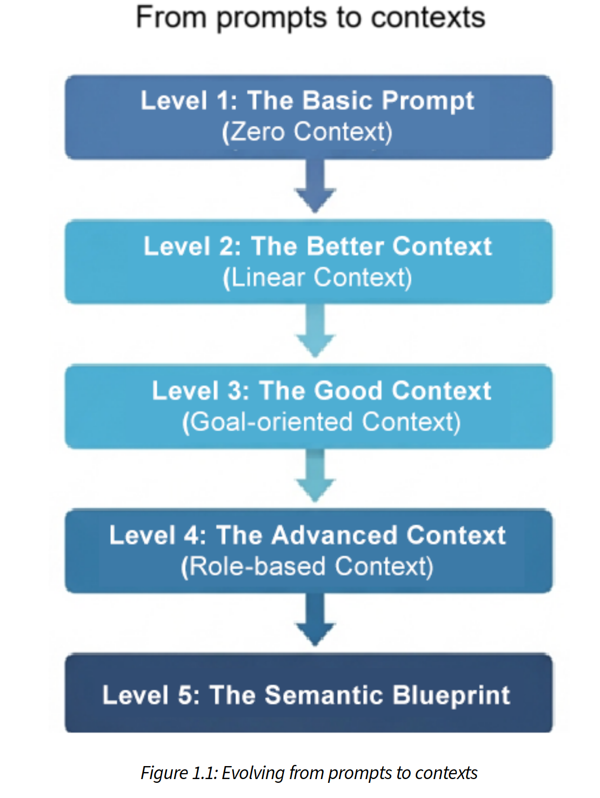
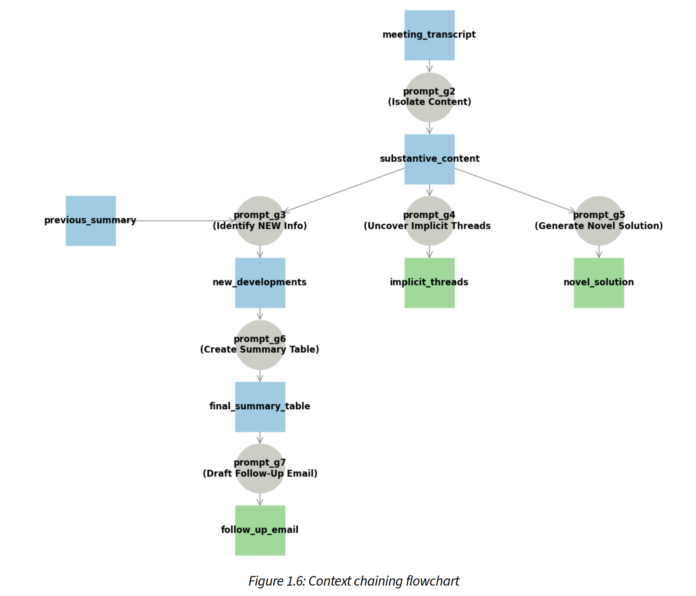
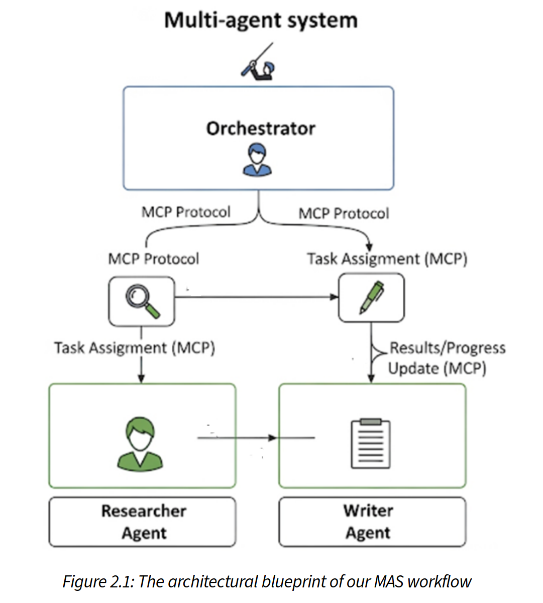
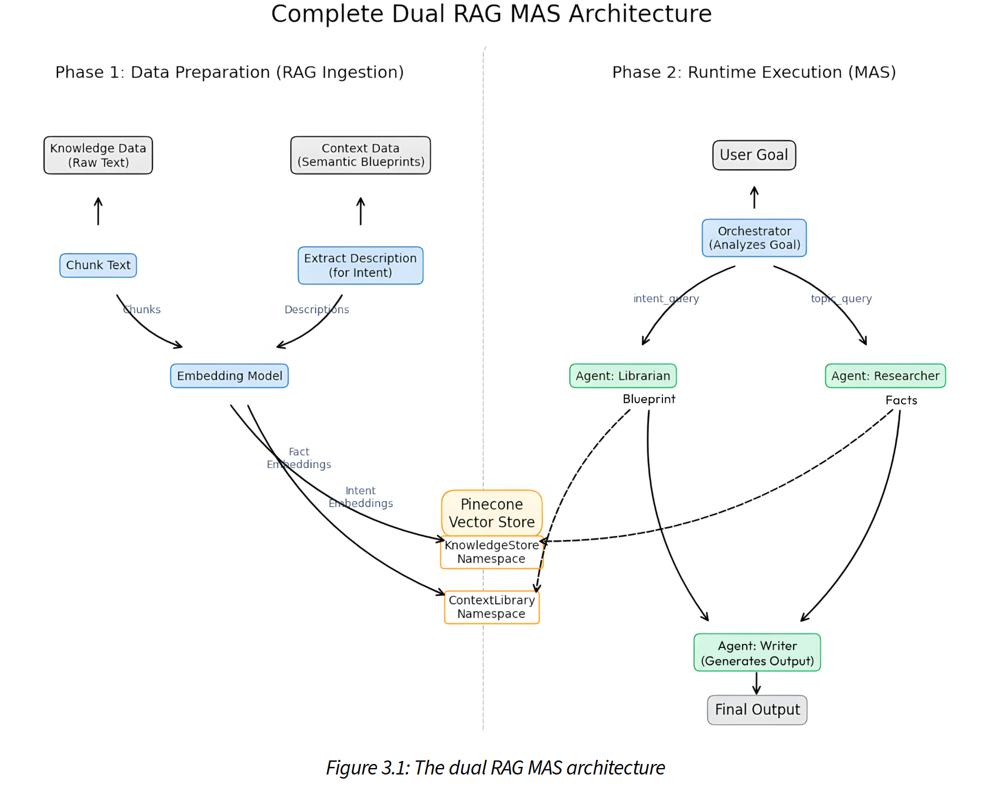
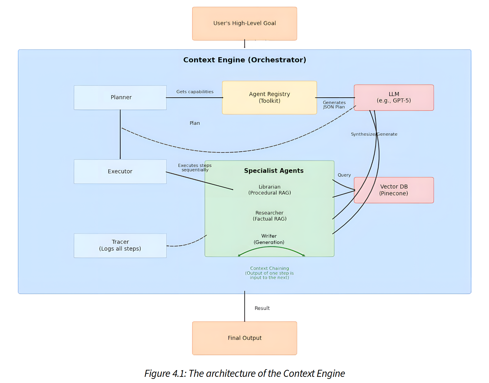

# Context Engineering for Multi-Agent System

Code reference: https://github.com/Denis2054/Context-Engineering-for-Multi-Agent-Systems

## Chapter 1: From Prompts to Context: Building the Semantic Blueprint

**5 cấp độ bối cảnh**

- **Cấp độ 1: Câu lệnh cơ bản** (Không có bối cảnh - Zero Context): Đây là một chỉ dẫn đơn giản, trực tiếp và không có thông tin nền tảng. AI sẽ đoán dựa trên dữ liệu đào tạo, thường tạo ra các kết quả chung chung hoặc rập khuôn
-  **Cấp độ 2: Bối cảnh tốt hơn** (Bối cảnh tuyến tính - Linear Context): Thêm một chuỗi thông tin tuyến tính giúp cải thiện độ chính xác về mặt thực tế so với cấp độ 1. Tuy nhiên, mô hình vẫn thiếu phong cách, mục đích hoặc định hướng rõ ràng
- **Cấp độ 3: Bối cảnh tốt (Bối cảnh hướng mục tiêu - Goal-oriented Context):** Đây được coi là cấp độ bối cảnh thực thụ đầu tiên. Bằng cách đưa ra một mục tiêu rõ ràng, các phản hồi của AI trở nên có chủ đích và bám sát yêu cầu hơn
- **Cấp độ 4: Bối cảnh nâng cao (Bối cảnh dựa trên vai trò - Role-based Context):** Cấp độ này có cấu trúc chặt chẽ hơn. Bằng cách gán các vai trò rõ ràng cho các đối tượng tham gia, mô hình có thể hiểu được các xung đột và động lực, từ đó tạo ra các phản hồi thông minh về mặt cốt truyện
- **Cấp độ 5: Bản thiết kế ngữ nghĩa (The Semantic Blueprint):** Đây là hình thức cao nhất của kỹ thuật bối cảnh. Một kế hoạch chính xác, không mơ hồ sử dụng các vai trò ngữ nghĩa sẽ biến hành động sáng tạo thành một quy trình kỹ thuật đáng tin cậy và có thể lặp lại

<div align="center">
  
</div>

**Level 1: The basic prompt (zero context)**

A basic prompt is a simple, direct instruction with no background information. The AI relies entirely on the most common statistical patterns from its training data, as we will see in this example

```
Complete this sentence: "The cat played with the...
```

**Level 2: The better context (linear context)**

Ở đây, chúng tôi thêm một câu đứng trước đơn giản làm ngữ cảnh bổ sung, câu này sẽ cung cấp một chuỗi thông tin tuyến tính, giúp cải thiện độ chính xác về mặt thực tế nhưng không định hướng phong cách hoặc mục đích của AI. Dữ liệu đầu vào của chúng tôi sẽ như sau:

```
Complete this sentence: The ball fell on the floor and it rolled for a few feet.  The cat then played with the...
```

Gemini 2.5's response is this:

```
The ball fell on the floor and it rolled for a few feet. The cat then played with  the ball.
```

Ở đây, phản hồi cũng chính xác về mặt thực tế và sáng tạo, nhưng một lần nữa, nó không biết phải tạo ra gì và tiếp tục một cách ngẫu nhiên. Các phản hồi không thực sự thuyết phục ngoài việc đưa ra các xác suất cơ bản, nhưng chúng tương đối chính xác. Điều này có thể phù hợp với các nhiệm vụ đơn giản, nhưng không phù hợp khi chúng ta cần mô hình AI sinh sinh thực hiện các nhiệm vụ cụ thể. Vậy hãy chuyển sang phần xây dựng ngữ cảnh và đặt ra mục tiêu.

**Level 3: The good context (goal-oriented context)**

Cấp độ này là bước thực sự đầu tiên trong kỹ thuật ngữ cảnh. Chúng tôi sẽ cung cấp một mục tiêu rõ ràng và các chi tiết mô tả phong phú hơn, cho phép LLM cùng tạo nên một bối cảnh phù hợp với mục đích mà chúng tôi hướng tới. Dữ liệu đầu vào của chúng tôi như sau:

```
Goal: Write a short, suspenseful scene for a children's story.  

---

Complete this sentence: 

"The ancient grandfather clock chimed midnight, its shadow stretching like a claw.  A red ball, seemingly moving on its own, rolled out from under the dusty armchair.  The black cat, Onyx, crouched low, his eyes gleaming. He then played with the..."
```

Here’s Gemini 2.5's response:

```
The ancient grandfather clock chimed midnight, its shadow stretching like a claw.  A red ball, seemingly moving on its own, rolled out from under the dusty armchair.  The black cat, Onyx, crouched low, his eyes gleaming. He then played with the...  tiny, shimmering thread tied to the ball.  He pounced, but the thread danced away, pulling the red ball with it. The ball  didn't just roll; it skittered across the floorboards as if it were alive, a  little red mouse being tugged towards the heavy velvet curtains by the window.  Onyx let out a low growl, a sound he never made when playing. The ball slipped  silently behind the thick, dark fabric. The thread hung in the air for a second,  taut and humming, before it too was yanked into the darkness. A tiny whisper, no  louder than the rustle of a leaf, echoed from behind the curtain. "Mine."
```

Trong trường hợp này, phản hồi cũng khá tốt và bắt đầu chính xác tại vị trí mà chúng ta đã yêu cầu. Nhìn chung, những phản hồi này sáng tạo và có chủ đích hơn so với ở Mức 2. Tuy nhiên, chúng vẫn chỉ được định hướng một cách lỏng lẻo. Để đạt được độ chính xác cao hơn nữa, chúng ta cần đưa cấu trúc vào chính ngữ cảnh.

**Level 4: The advanced context (role-based context)**

Rather than leaving the AI to infer the dramatic structure, we now define the roles of each participant. By providing the LLM with characters, objects, and relationships, we give it the scaffolding of conflict and motivation. This makes the response narratively intelligent. Our input will be as follows:

```
Goal: Write one suspenseful sentence to continue a children's story.

---

BACKGROUND:  
- Protagonist: Onyx, a brave black cat.
- Antagonist: An ancient, haunted grandfather clock.  
- Catalyst Object: A mysterious red ball.  
- Setting: A dark, dusty room at midnight.  
- Preceding Action: The clock chimed, and the ball rolled out.

---

Continue the story from this point: "The black cat, Onyx, crouched low... he then  played with the...
```

**Level 5: The semantic blueprint**

Mức này đại diện cho việc hiện thực hóa đầy đủ kiến trúc ngữ cảnh. Ở đây, chúng ta cung cấp cho model một kế hoạch chính xác và rõ ràng bằng cách sử dụng một định dạng có cấu trúc. Hành vi sáng tạo trở thành một quy trình kỹ thuật đáng tin cậy, được dẫn dắt bởi các vai trò ngữ nghĩa: mục tiêu của bối cảnh, các thành tố tham gia, mô tả của họ, hành động cụ thể cần hoàn thành, chủ thể (người/thực thể thực hiện hành động) và đối tượng (người/thực thể chịu ảnh hưởng nhiều nhất bởi hành động).

```
TASK: Generate a single, suspenseful sentence.

---
SEMANTIC BLUEPRINT:
{
  "scene_goal": "Increase tension by showing defiance",
  "participants": [
    {
      "name": "Onyx",
      "role": "Agent",
      "description": "black cat"
    },
    {
      "name": "Red Ball",
      "role": "Patient",
      "description": "mysterious"
    },
    {
      "name": "Grandfather Clock",
      "role": "Source_of_Threat",
      "description": "ancient, looming"
    }
  ],
  "action_to_complete": {
    "predicate": "play with",
    "agent": "Onyx",
    "patient": "Red Ball"
  }
}

---

SENTENCE TO COMPLETE: "He then played with the..."
```

Ở giai đoạn này, chúng ta không còn là những khán giả quan sát sự ứng biến của mô hình nữa. Chúng ta là đạo diễn, và LLM là diễn viên đang làm việc dựa trên kịch bản của chúng ta. Nhưng một bản thiết kế ngữ nghĩa như ở Cấp độ 5 hoạt động như thế nào? Để trả lời điều đó, chúng ta chuyển sang Gán Nhãn Vai Trò Ngữ Nghĩa (**Semantic Role Labelling – SRL**), một phương pháp sẽ đưa chúng ta vào chuyến hành trình đầu tiên từ các chuỗi ngôn ngữ tuyến tính đến những cấu trúc ngữ nghĩa đa chiều.

### SRL: from linear sequences to semantic structures

Hành trình của chúng ta qua năm cấp độ của kỹ thuật ngữ cảnh lên đến đỉnh điểm ở bản thiết kế ngữ nghĩa, một phương pháp cung cấp cho LLM một kế hoạch có cấu trúc thay vì một yêu cầu lỏng lẻo. Nhưng làm thế nào chúng ta xây dựng được một bản thiết kế như vậy từ dòng chảy tuyến tính, thường mơ hồ của ngôn ngữ tự nhiên của con người? Để làm được điều đó, chúng ta phải ngừng xem câu như những chuỗi từ và bắt đầu nhìn nhận chúng như những cấu trúc của ý nghĩa.

Quy trình xây dựng một sổ tay (notebook) **Gán nhãn vai trò ngữ nghĩa (Semantic Role Labeling - SRL)** bằng Python được thiết kế để chuyển đổi các thành phần thiết yếu của một câu thành một biểu đồ trực quan về ý nghĩa, thay vì chỉ để cấu trúc ẩn trong văn bản. Dưới đây là các bước chi tiết dựa trên tài liệu:

#### 1. Chuẩn bị và Cài đặt
Để chạy notebook này tại địa phương, bạn cần cài đặt các thư viện sau:
*   **Thư viện:** `spaCy`, `Matplotlib`, và `Graphviz`.
*   **Mô hình ngôn ngữ:** Tải mô hình tiếng Anh cho spaCy bằng lệnh `python -m spacy download en_core_web_sm`.
*   **Import công cụ:** Sử dụng `matplotlib.pyplot` để vẽ giao diện và `FancyArrowPatch` để vẽ các mũi tên kết nối giữa động từ và các vai trò của nó,.

#### 2. Cấu trúc hàm chính: `visualize_srl`
Trái tim của chương trình là hàm `visualize_srl`. Đây là điểm tương tác chính của người dùng.
*   **Tham số đầu vào:** Người dùng cung cấp các khối xây dựng của câu bao gồm: động từ (vị ngữ), tác nhân (Agent - người thực hiện hành động), đối tượng (Patient - thực thể chịu tác động), và các vai trò khác.
*   **Tính linh hoạt:** Hàm sử dụng `**kwargs` để cho phép truyền vào số lượng không giới hạn các thành phần bổ trợ tùy chọn như thời gian (temporal) hoặc địa điểm (location).
*   **Nhiệm vụ:** Tập hợp các vai trò này vào một từ điển Python (`srl_roles`) và chuyển chúng cùng với vị ngữ đến hàm vẽ nội bộ,.

#### 3. Quy trình thực thi 7 giai đoạn
Quy trình xây dựng và hiển thị sơ đồ (stemma) được thực hiện qua các bước sau,,:

1.  **Nhập liệu (User Input):** Gọi hàm `visualize_srl()` với các thành phần của câu.
2.  **Cấu trúc dữ liệu (Data Structuring):** Sắp xếp các thành phần vào một từ điển với nhãn SRL chính xác.
3.  **Chuyển giao cho công cụ vẽ (Hand-off):** Chuyển từ điển dữ liệu cho hàm `_plot_stemma`.
4.  **Thiết lập khung bản vẽ (Canvas Setup):** Sử dụng Matplotlib để tạo một khung trống, tắt các trục tọa độ vì đây là một sơ đồ chứ không phải đồ thị truyền thống,,.
5.  **Định vị động (Dynamic Positioning):** Tính toán vị trí của từng nút vai trò sao cho bố cục rõ ràng và cân đối, bất kể có bao nhiêu thành phần được thêm vào,.
6.  **Vẽ sơ đồ (Drawing the Stemma):** Vẽ động từ cốt lõi làm nút gốc (root node), thêm các vai trò làm nút con và kết nối chúng bằng các mũi tên có nhãn.
7.  **Hiển thị cuối cùng (Final Display):** Thêm tiêu đề và hiển thị bản thiết kế ngữ nghĩa hoàn chỉnh.

#### 4. Định nghĩa các vai trò ngữ nghĩa trong Code
Notebook cần xác định rõ các vai trò để LLM có thể hiểu và làm theo:
*   **Vị ngữ (Predicate):** Trung tâm của câu, hành động chính.
*   **Tác nhân (ARG0):** Thực thể thực hiện hành động ("người làm").
*   **Đối tượng (ARG1):** Thực thể bị tác động trực tiếp bởi động từ.
*   **Người nhận (ARG2):** Thực thể nhận kết quả của hành động.
*   **Thành phần bổ trợ (ARGM-):** Cung cấp bối cảnh bổ sung như Thời gian (TMP), Địa điểm (LOC), hoặc Cách thức (MNR).

#### 5. Ý nghĩa kỹ thuật
Việc xây dựng notebook này không chỉ nhằm mục đích minh họa mà còn là kỹ năng nền tảng của **kỹ thuật bối cảnh nâng cao**. Nó biến một chuỗi từ ngữ tuyến tính thành một **bản thiết kế ngữ nghĩa (semantic blueprint)** có cấu trúc, giúp AI tạo sinh hoạt động theo một kế hoạch chính xác và có thể dự đoán được thay vì đoán mò dựa trên xác suất thống kê,.


### Defining the semantic roles


Trong kỹ thuật bối cảnh, thay vì xem một câu chỉ là một chuỗi các từ ngữ phẳng, người kỹ sư sẽ gán nhãn cho từng phần của câu dựa trên **vai trò chức năng** của chúng trong hành động. Việc sử dụng các nhãn này là công cụ chính để xác định ý nghĩa và thêm cấu trúc đa chiều cho văn bản, giúp mô hình ngôn ngữ lớn (LLM) hiểu rõ "ai đã làm gì với ai, khi nào và tại sao".

Các vai trò ngữ nghĩa cốt lõi bao gồm:

*   **Vị ngữ (Predicate - Động từ):** Đây là **trái tim của câu**, đại diện cho hành động trung tâm hoặc trạng thái tồn tại. Mọi vai trò khác đều được định nghĩa trong mối quan hệ với vị ngữ này. Ví dụ: trong câu "Sarah đã trình bày dự án", từ "trình bày" (pitched) là vị ngữ.
*   **Tác nhân (Agent - ARG0):** Đây là thực thể thực hiện hành động, hay còn gọi là **"người làm"**. Trong ví dụ trên, "Sarah" chính là tác nhân.
*   **Đối tượng (Patient - ARG1):** Thực thể **bị tác động trực tiếp** hoặc chịu sự tác động của động từ. Trong ví dụ, "dự án mới" (the new project) là đối tượng.
*   **Người nhận (Recipient - ARG2):** Thực thể **nhận đối tượng** hoặc nhận kết quả của hành động. Ví dụ: "ban giám đốc" (the board) là người nhận trong việc trình bày dự án.

**Các thành phần bổ trợ (Argument Modifiers - ARGM-):**
Đây là các vai trò bổ sung nhằm cung cấp bối cảnh nhưng **không nằm ở trung tâm của hành động**. Chúng trả lời các câu hỏi về thời gian, địa điểm, lý do hoặc cách thức:
*   **Thời gian (Temporal - ARGM-TMP):** Xác định **khi nào** hành động xảy ra (ví dụ: "vào buổi sáng").
*   **Địa điểm (Location - ARGM-LOC):** Xác định **nơi chốn** hành động diễn ra (ví dụ: "trong phòng họp").
*   **Cách thức (Manner - ARGM-MNR):** Xác định **cách thức** hành động được thực hiện (ví dụ: "với sự tự tin cao").

#### Ý nghĩa của việc định nghĩa các vai trò này:
Khi các vai trò này được thiết lập, một câu không còn là một chuỗi ký tự đơn thuần mà trở thành một **bản đồ ý nghĩa có cấu trúc**. Điều này cho phép xây dựng một **bản thiết kế ngữ nghĩa (semantic blueprint)** chính xác, giúp LLM thực hiện các nhiệm vụ phức tạp một cách đáng tin cậy và có thể lặp lại, thay vì chỉ dựa vào dự đoán xác suất ngẫu nhiên.

### Engineering a meeting analysis use case

<div align="center">
  
</div>

Sơ đồ luồng kết nối bối cảnh (**Context chaining flowchart**) trong Chương 1 (Hình 1.6) minh họa một kỹ thuật mạnh mẽ nhằm điều hướng LLM thông qua một quy trình phân tích đa bước,. Thay vì sử dụng một câu lệnh (prompt) khổng lồ và phức tạp, quy trình này sử dụng một **chuỗi các câu lệnh tập trung và đơn giản hơn**, trong đó kết quả đầu ra của bước này sẽ trở thành đầu vào cho bước tiếp theo.

Dưới đây là giải thích chi tiết về cấu trúc và các bước trong sơ đồ này:

#### Cấu trúc và Lợi ích cốt lõi
*   **Cấu trúc phân nhánh:** Sơ đồ này không phải là một đường thẳng duy nhất mà có cấu trúc phân nhánh, cho phép thực hiện phân tích đa nhiệm song song từ một nguồn dữ liệu đã được làm sạch.
*   **Kiểm soát và Chính xác:** Kỹ thuật này giải quyết vấn đề LLM không có trí nhớ dài hạn thực sự bằng cách chia nhỏ tác vụ phức tạp thành các bước hội thoại có kiểm soát. Nó giúp người kỹ sư hướng dẫn quá trình suy nghĩ của AI ở từng giai đoạn, đảm bảo phân tích đi đúng hướng.
*   **Dễ dàng tinh chỉnh:** Nếu một bước tạo ra kết quả kém, bạn biết chính xác cần sửa câu lệnh nào thay vì phải gỡ lỗi một chỉ dẫn nguyên khối.

#### Các giai đoạn thực thi trong sơ đồ (7 Bước)
Quy trình biến đổi một bản ghi cuộc họp thô thành các hành động chuyên nghiệp thông qua các lớp sau,,:

1.  **Nhập bản ghi thô (meeting_transcript):** Cung cấp nguồn dữ liệu thô duy nhất cho hệ thống.
2.  **Tách nội dung chính (g2):** Làm sạch dữ liệu bằng cách tách tín hiệu (quyết định, cập nhật, vấn đề) khỏi nhiễu (lời chào hỏi, tán gẫu). Đây là **điểm phân nhánh chính** để dẫn vào các bước song song.
3.  **Xác định diễn biến mới (g3):** Tìm kiếm các thông tin mới so với bản tóm tắt cũ trước đó.
4.  **Phân tích động lực ngầm (g4):** Đi sâu vào việc phân tích cảm xúc, sự do dự hoặc các tầng nghĩa ẩn bên dưới những lời nói trực tiếp.
5.  **Tạo giải pháp mới lạ (g5):** Tổng hợp các sự thật để đưa ra những ý tưởng sáng tạo và hành động mới.
6.  **Tạo bản tóm tắt có cấu trúc (g6):** Định dạng các diễn biến mới thành một bảng dữ liệu rõ ràng.
7.  **Dự thảo hành động tiếp theo (g7):** Chuyển đổi bảng tóm tắt thành một **email theo dõi chuyên nghiệp** gửi cho nhóm.

#### Ý nghĩa chiến lược
Kết nối bối cảnh biến LLM từ một "người ghi chú" đơn thuần trở thành một **đối tác sáng tạo**. Nó cho phép con người giữ vai trò trung tâm để thiết kế các kịch bản tư duy cho AI, giúp nâng cao hiệu quả vận hành của đội ngũ và doanh nghiệp.

***

**Phép ẩn dụ:**
Việc sử dụng **Context Chaining** giống như việc bạn **hướng dẫn một trợ lý mới làm việc**; thay vì ném cho họ một chồng tài liệu dày cộp và bảo "hãy tóm tắt tất cả", bạn yêu cầu họ: "Trước hết hãy lọc ra các con số quan trọng, sau đó so sánh chúng với tháng trước, và cuối cùng hãy viết một bản ghi chú cho tôi." Cách làm này giúp trợ lý không bị choáng ngợp và luôn đưa ra kết quả chính xác theo từng giai đoạn.

## Chapter 2 Building a Multi-Agent System with MCP

<div align="center">
  
</div>

- **Orchestrator (the project manager)**:
Trình Điều Phối là bộ não của toàn bộ hoạt động. Nó không tự thực hiện các nhiệm vụ chuyên môn mà quản lý toàn bộ quy trình làm việc. Nó tiếp nhận mục tiêu cấp cao của người dùng, phân rã mục tiêu đó thành các bước logic và phân công từng bước cho tác nhân phù hợp. Nó cũng chịu trách nhiệm tiếp nhận kết quả từ một tác nhân và truyền chúng như là ngữ cảnh cho tác nhân tiếp theo. Nói cách khác, nó áp dụng việc xâu chuỗi ngữ cảnh ở cấp độ hệ thống cho MAS của chúng ta.

- **Researcher agent (the information specialist)**:
Đây là tác nhân chuyên biệt đầu tiên của chúng ta. Mục đích của nó là tiếp nhận một chủ đề cụ thể, tìm thông tin liên quan và tổng hợp thông tin đó thành một bản tóm tắt có cấu trúc. Trong dự án của chúng ta, nó sẽ nhận một nhiệm vụ nghiên cứu từ Orchestrator và trả lại kết quả dưới dạng danh sách rõ ràng theo từng gạch đầu dòng.

- **Writer agent (the content creator)**:
Đây là tác nhân chuyên biệt thứ hai của chúng tôi. Thế mạnh của nó nằm ở giao tiếp và biểu đạt sáng tạo. Nó tiếp nhận bản tóm tắt có cấu trúc từ Nhà nghiên cứu và chuyển hóa nó thành một nội dung hoàn chỉnh, dễ đọc đối với con người, với sự chú ý cẩn trọng đến giọng điệu, phong cách và tính tự sự.

Thông tin không chỉ được truyền đi dưới dạng văn bản thô. Mỗi tương tác giữa các tác nhân đều được đóng gói thành thông điệp MCP có cấu trúc. Điều này đảm bảo rằng các tác vụ và kết quả luôn được truyền đi với đầy đủ ngữ cảnh, trong một định dạng nhất quán, có thể dự đoán và đáng tin cậy. MCP là mô liên kết biến một tập hợp các tác nhân riêng lẻ thành một hệ thống tích hợp.

> Trong cuốn sách này, chúng tôi khám phá hướng tiếp cận tiên tiến trong việc áp dụng các nguyên tắc MCP vào giao tiếp giữa các tác tử. Mặc dù MCP ban đầu được thiết kế cho tương tác giữa tác tử và công cụ, các nghiên cứu gần đây (chẳng hạn như Microsoft’s Can You Build Agent2Agent Communication on MCP? Yes!) cho thấy những khả năng đang phát triển của MCP có thể hỗ trợ các mô thức phối hợp liên tác tử mới nổi.

## Chapter 3 Building the Context-Aware MultiAgent System

<div align="center">
  
</div>

## Chapter 4 Context Engine

<div align="center">
  
</div>